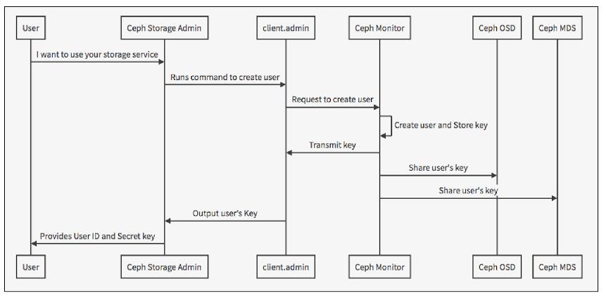

# Ceph authentication.

- Ceph là một hệ thống lưu trữ phân tán. Trên đó được cài đặt các daemon monitors, metadata server (MDs), và OSD. Các daemon được triển khai trên nhiều server. Ceph clients như là CephFS, Ceph Block device, và Ceph Gateway tương tác với Ceph object store. Tất cả Ceph object store clients sử dụng thư viện `librados` để tương tác với ceph object store. Hình sau đây minh họa cho tổ chức stack của ceph

<p align="center">

</p>

- Người dùng, có thể là end user hoặc là dịch vụ hệ thống như là các ứng dụng, sử dụng Ceph clients để tương tác với các Ceph server daemon.

<p align="center">

</p>

## Ceph authentication
- Xác thực mật mã mất vài chi phí cho việc tính toán, tuy nhiên chúng khá là thấp. Nếu môi trường kết nối mạng giữa client và server trong cluster của bạn rất an toàn và bạn không cho xác thực thì bạn có thể sử dụng tùy chọn để tắt cơ chế xác thực. Việc làm này không được khuyến khích.
- Ceph tránh việc tập trung interface tới ceph object store, có nghĩa là ceph clients phải được tương tác trực tiếp với OSDs. Để bảo vệ dữ liệu, ceph cung cấp một hệ thống xác thực `cephx`, hệ thống để các thực users.
- Users yêu cầu ceph client liên hệ với một monitor.  Mỗi monitor đều có khả năng xác thực người dùng và phân phối key, do vậy không có "single point of failure" hoặc bottleneck khi sử dụng cephx. Monitor trả về một bộ dữ liệu xác thực gọi là ticket chứa session key để sử dụng các service của ceph. Session key được mã hóa với các tham số bí mật của user, do vậy chỉ có user mới có thể yêu cầu dịch vụ từ ceph monitor. Client sử dụng session key này để yêu cầu dịch vụ từ monitor, và monitor cung cấp cho user một ticket, ticket này sẽ xác thực người dùng để sử dụng osd. Monitor và osd chia sẻ một bí mật, do đó client có thể sử dụng ticket đã được monitor cung cấp với bất kỳ osd hay là mds. Ticket này có giới hạn thời gian.
- Để sử dụng cephx, trước hết quản trị viên phải cấu hình các users. Trong hình dưới đây, user `client.admin` sẽ sử dụng lệnh `ceph auth get-or-create-key` để sinh ra username và khóa bí mật. Hệ thống sẽ sinh ra một username và khóa bí mật, lưu một bản sao lại cho mons và chuyển khóa bí mật lại cho user `client.admin`. Đây có nghĩa là client và mon chia sẻ khóa bí mật.	

<p align="center">

</p>

- Để xác thực với mons, người dùng cung cấp username cho mon, mon sẽ sinh ra một session key và mã hóa nó với khóa bí mật đã liên kết với tên người dùng. Sau đó mon sẽ gửi session key này lại cho người dùng. Sau đó người dùng sẽ giả mã bằng khóa chia sẻ đã nhận được từ bước trước. Session key này dùng để định danh người dùng ở phiên hiện tại. Sau đó người dùng sẽ yêu cầu một ticket đại diện cho người dùng được ký bởi session key. Monitor sinh ra một ticket, mã hóa nó với khóa bí mật của người dùng và chuyển nó lại cho người dùng. Người dùng giải mã ticket và dùng nó để ký lên yêu cầu gửi lên OSD và MDS.

<p align="center">

</p>

- Giao thức xác thực cephx truyền thông giữa client và ceph server. Mỗi thông điệp được gửi giữa client và server được ký bởi ticket mà các monitor, OSD, MDS có thể xác thực bằng key chia sẻ:

<p align="center">

</p>

- Toàn bộ quá trình được mô tả trong hình sau:


<p align="center">

</p>

- Thứ tự các bước như sau:
- 1. Một user muốn sử dụng dịch vụ lưu trữ ceph sẽ gửi một yêu cầu tạo user cho người quản trị
- 2. admin của hệ thống ceph, là client.admin user, sử dụng lệnh đề tạo user trên hệ thống.
- 3. Khi admin gọi lệnh tạo user, monitor sẽ tạo ra một secret key. Key này sẽ được monitor lưu lại, sau đó chuyển key này về cho admin và đồng thời chia sẽ cho các daemon trong hệ thống. Định dạng key như sau

```sh
[client.user1]
key = AQAxTExa7LLVCxAAciEex6+YOOoneg5y7i822g==
```

- 4. admin nhận được key sẽ phải xuất ra dạng file để chuyển key này cho user (người yêu cầu sử dụng dịch vụ).
- 5. user sẽ sự dụng key này để tương tác với hệ thống. User được sử dụng những quyền gì trong hệ thống sẽ do admin cấp phát.

## Các lệnh thao tác xác thực trên Ceph

- Hiển thị toàn bộ các key authen của cụm Ceph
```sh 
ceph auth list
```

Kết quả tương tự
```sh 
installed auth entries:

osd.0
	key: AQBvb/dcCEvGCxAAvpcVxXl6gICThtvefxnMkA==
	caps: [mgr] allow profile osd
	caps: [mon] allow profile osd
	caps: [osd] allow *
osd.1
	key: AQCEb/dcZ4OPLRAAvnIW2/IZ4Xc8AGDlVkUc2Q==
	caps: [mgr] allow profile osd
	caps: [mon] allow profile osd
	caps: [osd] allow *
osd.2
	key: AQCab/dcde53CxAAnY7ZoCwvEfdgrNACGC6Tiw==
	caps: [mgr] allow profile osd
	caps: [mon] allow profile osd
	caps: [osd] allow *
client.admin
	key: AQAhI/dcEbhkFhAAkrwC+4q/GmSkcw+7poH/Dw==
	caps: [mds] allow *
	caps: [mgr] allow *
	caps: [mon] allow *
	caps: [osd] allow *
client.bootstrap-mds
	key: AQAhI/dcdxplFhAAA6sxx7GukIRfKjRiBvIAeQ==
	caps: [mon] allow profile bootstrap-mds
client.bootstrap-mgr
	key: AQAhI/dcaWRlFhAA6ntAB8FaetAnjgSkNctRUQ==
	caps: [mon] allow profile bootstrap-mgr
client.bootstrap-osd
	key: AQAhI/dc7KxlFhAAOD5Ou+exuyyTiV9V5AO9nw==
	caps: [mon] allow profile bootstrap-osd
client.bootstrap-rbd
	key: AQAhI/dcovZlFhAABlFFaRi4KlwrGuPIFrRB3Q==
	caps: [mon] allow profile bootstrap-rbd
client.bootstrap-rbd-mirror
	key: AQAhI/dc2z1mFhAASkA6rv/kdMQ7qW30TKVUZA==
	caps: [mon] allow profile bootstrap-rbd-mirror
client.bootstrap-rgw
	key: AQAhI/dc4YZmFhAAPzH58U35Fu12EVx+fn/FFQ==
	caps: [mon] allow profile bootstrap-rgw
mgr.cephaio
	key: AQBKI/dcPGZ4IhAAUWgVpADZL0lR8FYmaHiL3w==
	caps: [mds] allow *
	caps: [mon] allow profile mgr
	caps: [osd] allow *
```

- Create hoặc get key 
```sh 
ceph auth get-or-create {key-name} mon {permission} osd {permission} mds {permission} > {key-name}.keyring
```

> ## Các caps chính là permision của key trên từng service

- Cập nhật permission key đã có 
```sh 
ceph auth caps {key-name} mon {permission} osd {permission} mds {permission}
```

- Xóa key
```sh 
ceph auth delete {key-name}
```

## Tài liệu tham khảo
Link: http://docs.ceph.com/docs/firefly/rados/operations/auth-intro/