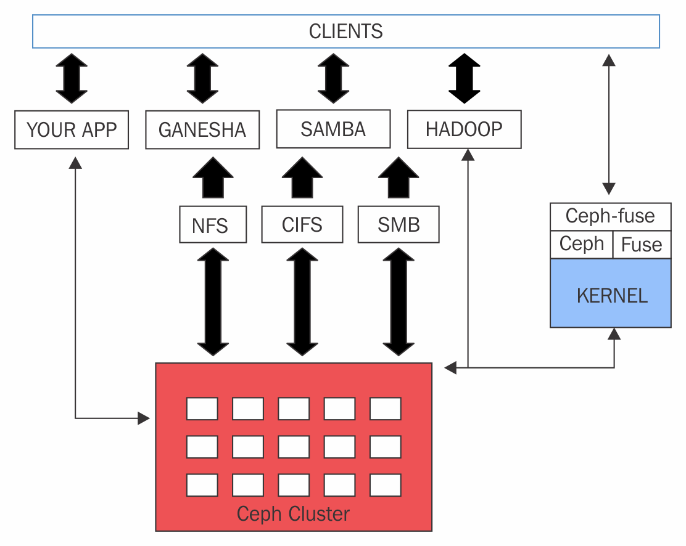

# Ceph MDS (Metadata Server)

Ceph MDS là daemon cho Ceph filesystem (CephFS). Ceph MDS cho phép Client mount 1 POSIX filesystem ở bất cứ kích thước nào. MDS không đưa dữ liệu tới người dùng, OSD làm việc đó. MDS cung cấp một filesystem chia sẻ với lớp cache thông minh;, giảm đáng kể lượng đọc và ghi.

MDS là thành phần duy nhất trong ceph chưa production, hiện chỉ 1 ceph MDS daemon hoạt động tại 1 thời điểm. MDS không lưu dữ liệu local. Nếu 1 MDS daemon lỗi, ta có thể tạo lại trên bất cứ hệ thống nào mà cluster có thể truy cập. Các metadata server daemon được cấu hình là active-passive. Primary MDS là acive, còn các node khác chạy standby. 

## 1. Ceph filesystem

CephFS cung cấp một filesystem tương thích POSIX nằm trên RADOS. Nó dùng MDS daemon để quản lý metadata tách biệt khỏi data. CephFS kế thừa các tính năng từ RADOS và cung cấp cân bằng tải cho dữ liệu.

Thư viện `libcephfs` đóng vai trò quan trọng trong việc hỗ trợ nhiều người dùng. Nó hỗ trợ Linux kernel driver, do vậy người dùng có thể dùng phương thức mounting filesystem truyền thống thông qua lệnh `mount`. Nó tích hợp chặt chẽ với SAMBA và hỗ trợ CIFS và SMB. CephFS hỗ trợ filesystem in userspace(FUSE) dùng module `cephfuse`. Nó cũng hỗ trợ ứng dụng tương tác trực tiếpvới RADOS cluster dùng thư viện libcephfs.

CephFS có khả năng thay thế Hadoop HDFS. HDFS chỉ chạy trên node đơn, ảnh hưởng tới khả năng mở rộng và tạo SPOF. Không như HDFS, CephFS có thể triển khai nhiều MDS chạy active-active, do vậy có khả năng giãn nở cao, hiệu năng tốt, không có SPOF. 