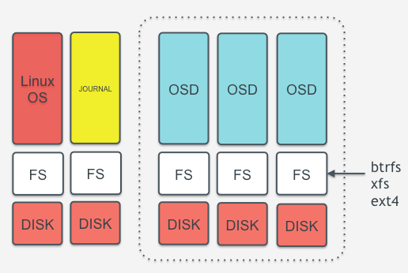
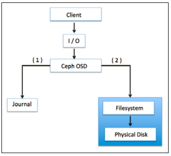

# Ceph OSD (Object Storage Device)
CEPH OSD lưu dữ liệu thực trên các ổ đĩa vật lý dưới dạng các object. Một Ceph cluster có rất nhiều OSD. Với bẩt cứ tác vụ đọc hoặc ghi nào, client gửi yêu cầu về cluster map tới node monitor, và sau đó tương tác trực tiếp với OSD cho các tác vụ đọc ghi, mà không cần sự can thiệp của node monitor. Điều này giúp việc chuyển tải dữ liệu nhanh chóng khi client có thể ghi trực tiếp vào các OSD mà không cần lớp xử lý dữ liệu trung gian. Cơ chế lưu trữ này là đôc nhất trên Ceph khi so với các phương thức lưu trữ khác.

Ceph nhân bản mỗi object nhiều lần trên tất cả các node, nâng cao tính sẵn sàng và khả năng chống chịu lỗi. Mỗi object trong OSD có một primary copy và nhiều secondary copy, được đặt tại các OSD khác. Bởi Ceph là hệ thống phân tán và object được phân tán trên nhiều OSD, mỗi OSD đóng vai trò là primary OSD cho một số object, và là secondary OSD cho các object khác. khi một ổ đĩa bị lỗi, Ceph OSD daemon tương tác với các OSD khác để thực hiện việc khôi phục. Trong quá trình này, secondary OSD giữ bản copy được đưa lên thành primary, và một secondary object được tạo, tất cả đều trong suốt với người dùng. Điều này làm Ceph Cluster tin cậy và nhất quán. Thông thường, một OSD daemon đặt trên mọt ổ đĩa vật lý , tuy nhiên có thể đặt OSD daemon trên một host, hoặc 1 RAID. Ceph Cluster thường được triển khai trong môi trường JBOD, mỗi OSD daemon trên 1 ổ đĩa.

## 1. Ceph OSD File System

<p align="center">

</p>

Ceph OSD gồm 1 ổ cứng vật lý, Linux filesystem trên nó, và sau đó là Ceph OSD Service. Linux filesystem của Ceph cần hỗ trợ *extended attribute (XATTRs)*. Các thuộc tính của filesystem này cung cấp các thông tin về trạng thái object, metadata, snapshot và ACL cho Ceph OSD daemon, hỗ trợ việc quản lý dữ liêu.
Ceph OSD hoạt động trên ổ đĩa vật lý có phân vùng Linux. Phân vùng Linux có thể là Btrfs, XFS hay Ext4. Sự khác nhau giữa các filesystem này như sau:

- `Btrfs`: filesystem này cung cấp hiệu năng tốt nhất khi so với XFS hay ext4. Các ưu thế của Btrfs là hỗ trợ copy-on-write và writable snapshot, rất thuận tiện khi cung cấp VM và clone. Nó cũng hỗ trợ nén và checksum, và khả năng quản lý nhiều thiết bị trên cùng môt filesystem. Btrfs cũng hỗ trợ XATTRs, cung cấp khả năng quản lý volume hợp nhất gồm cả SSD, bổ xung tính năng fsck online. Tuy nhiên, btrfs vẫn chưa sẵn sàng để production.
- `XFS`: Đây là filesystem đã hoàn thiện và rất ổn định, và được khuyến nghị làm filesystem cho Ceph khi production. Tuy nhiên, XFS không thế so sánh về mặt tính năng với Btrfs. XFS có vấn đề về hiệu năng khi mở rộng metadata, và XFS là một journaling filesystem, có nghĩa, mỗi khi client gửi dữ liệu tới Ceph cluster, nó sẽ được ghi vào journal trước rồi sau đó mới tới XFS filesystem. Nó làm tăng khả năng overhead khi dữ liệu được ghi 2 lần, và làm XFS chậm hơn so với Btrfs, filesystem không dùng journal.
- `Ext4`: đây cũng là một filesystem dạng journaling và cũng có thể sử dụng cho Ceph khi production; tuy nhiên, nó không phôt biến bằng XFS. Ceph OSD sử dụng *extended attribute* của filesystem cho các thông tin của object và metadata. XATTRs cho phép lưu các thông tin liên quan tới object dưới dạng `xattr_name` và `xattr_value`, do vậy cho phép *tagging* object với nhiều thông tin metadata hơn. ext4 file system không cung cấp đủ dung lượng cho XATTRs do giới hạn về dung lượng bytes cho XATTRs. XFS có kích thước XATTRs lớn hơn.

## 2. Ceph OSD Journal

Có thể hiểu đơn giản Journal disk chính là phân vùng cached để lưu trữ dữ liệu, Tăng tốc độ ghi dữ liệu. Sau đó Ceph sẽ flush dần data này xuống lưu trữ dưới HDD

<p align="center">

</p>

Ceph dùng các journaling filesystem là XFS cho OSD. Trước khi commit dữ liệu vào backing store, Ceph ghi dữ liệu vào một vùng lưu trữ tên là journal trước, vùng này hoạt động như là một phân vùng đệm (buffer), journal nằm cùng hoặc khác đĩa với OSD, trên một SSD riêng hoặc một phân vùng, thậm chí là một file riêng trong filesystem. Với cơ chế này, Ceph ghi mọi thứ vào journal, rồi mới ghi vào backing storage.

Một dữ liệu ghi vào journal sẽ được lưu tại đây trong lúc syncs xuống backing store, mặc định là 5 giây chạy 1 lần. 10 GB là dung lượng phổ biến của journal, tuy nhiên journal càng lớn càng tốt. Ceph dùng journal để tăng tốc và đảm bảo tính nhất quán. Journal cho phép Ceph OSD thực hiện các tác vụ ghi nhỏ nhanh chóng; một tác vụ ghi ngẫu nhiên sẽ được ghi xuống journal theo kiểu tuần tự, sau đó được *flush* xuống filesystem. Điều này cho phép filesystem có thời gian để gộp các tác vụ ghi vào ổ đĩa. Hiệu năng sẽ tăng lên rõ rệt khi journal được tạo trên SSD.

Khuyến nghị, không nên vượt quá tỉ lệ 5 OSD / 1 journal đisk khi dùng SSD làm journal, vượt quá tỉ lệ này có thể gây nên thắt cổ chai trên cluster. Và khi SSD làm journal bị lỗi, toàn bộ các OSD có journal trên SSD đó sẽ bị lỗi.
Với Btrfs, việc này sẽ không xảy ra, bởi Btrfs hỗ trợ copy-on-write, chỉ ghi xuống các dữ liệu thay đổi, mà không tác động vào dữ liệu cũ, khi journal bị lỗi, dữ liệu trên OSD vẫn tồn tại.

> Đối với hệ thống lưu trữ dữ liệu [BlueStore](bluestore_vs_filestore.md) thì không còn sử dụng Journal disk 

## 3. Ceph disk
Không nên sử dụng RAID cho Ceph Cluster:
- Mặc định Ceph đã có khả năng nhân bản để bảo vệ dữ liệu, do đó không cần làm RAID với các dữ liệu đã được nhân bản đó. Với RAID group, nếu mất 1 ổ đĩa, việc phục hồi sẽ yêu cầu một ổ đĩa dự phòng, tiếp đó là chờ cho dữ liệu từ đĩa bị hỏng được ghi lên đĩa mới, do đó việc sử dụng RAID sẽ gây mất nhiều thời gian khi khôi phục cũng như giảm hiệu năng khi so với giải pháp lưu trữ phân tán. Tuy nhiên, nếu hệ thống có RAID controller, ta sẽ đặt mỗi ổ đĩa trong một RAID 0.
- Phương pháp nhân bản dữ liệu của Ceph khong yêu câu một ổ cứng trống cùng dung lượng ổ hỏng. Nó dùng đường truyền mạng để khôi phục dữ liệu trên ổ cứng lỗi từ nhiều node khác. Trong quá trình khôi phục dữ liệu, dựa vào tỉ lệ nhân bản và số PGs, hầu như toàn bộ các node sẽ tham gia vào quá trình khôi phục, giúp quá trình này diễn ra nhanh hơn.
- Sẽ có vấn đề về hiệu năng trên Ceph Cluster khi I/O ngẫu nhiên trên RAID 5 và 6 rất chậm.

## 4. Ceph volume

Ở phiên bản từ 11.x khái niệm ceph-volume được xuất hiện thay thế dần và tiến tới thay thế hoàn toàn cho `ceph-disk`

## 5. OSD commands
Một số câu lênh phổ biến để thao tác với OSD

- Lệnh để kiểm tra tình trạng OSD trên 1 node:
```
service ceph status osd
```

- Lệnh kiểm tra tình trạng OSD trên tất cả các node (lưu ý thông tin về tất cả OSD phải được khai báo trong `ceph.conf`):
```
service ceph -a status osd
```

- Lệnh kiểm tra OSD ID:
```
ceph osd ls
```

- Lệnh kiểm tra OSD map:
```
ceph osd stat
```

- Lệnh kiểm tra OSD tree:
```
ceph osd tree
```