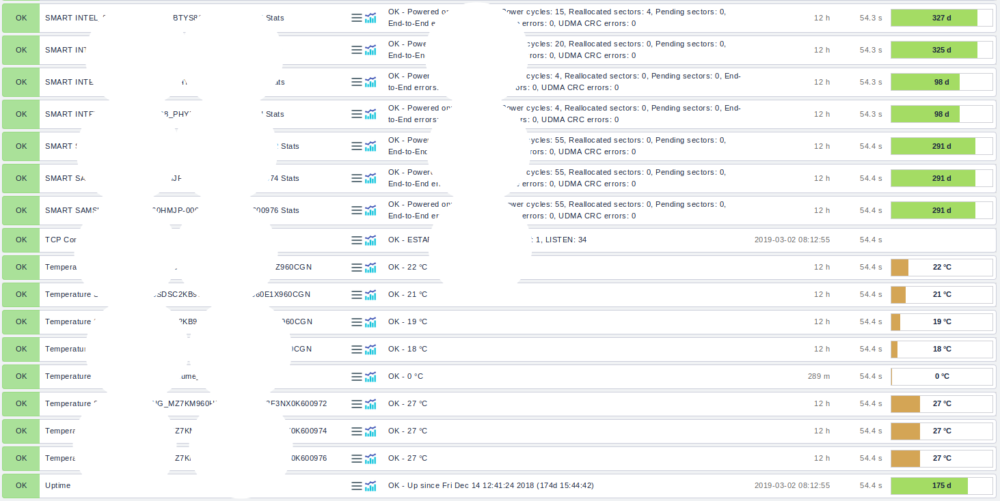

# Cài đặt check_mk


# Bổ sung agent check_mk check disk

```sh 
yum install smartmontools -y && sudo apt-get install smartmontools 
cd /usr/lib/check_mk_agent/plugins
wget https://raw.githubusercontent.com/nhanhoadocs/scripts/master/Utilities/smart
chmod +x smart
./smart
```

Kiểm tra bằng tay 
```sh 
sudo smartctl -i /dev/sda 
```

Discovery trên `check_mk`


Các tham số chi tiết hiển thị trên Check_mk 

```sh 
OK - Powered on: 7856 hours, Power cycles: 15, Reallocated sectors: 4, Pending sectors: 0, End-to-End errors: 0, Uncorrectable errors: 0, UDMA CRC errors: 0
```


- **Powered on:** Số giờ disk đã chạy https://kb.acronis.com/content/9109
- **Power cycles:** Số lần bật tắt nguồn của ổ  https://kb.acronis.com/content/9112
- **Reallocated sectors:** Số lượng sector bị bad hệ thống phát hiện và đã di chuyển dữ liệu sang sector khác https://kb.acronis.com/content/9105
- **Pending sectors:** Số lượng sector không ổn định đang chờ để map lại sector khác https://kb.acronis.com/content/9133
- **End-to-End errors:** Số lượng dữ liệu tham chiếu giữa bộ đệm RAM và disk không khớp  https://kb.acronis.com/content/9119
- **Uncorrectable errors:** Số lượng lỗi ổ cứng không thể phục hồi bằng chức năng ECC (error-correcting code) https://kb.acronis.com/content/9122
- **UDMA_CRC_Error_Count:** Số lượng lỗi trong quá trình truyền dữ liệu (Có thể do dây SAS, card RAID, hoặc là bộ phận điều khiển trên Disk) https://kb.acronis.com/content/9135