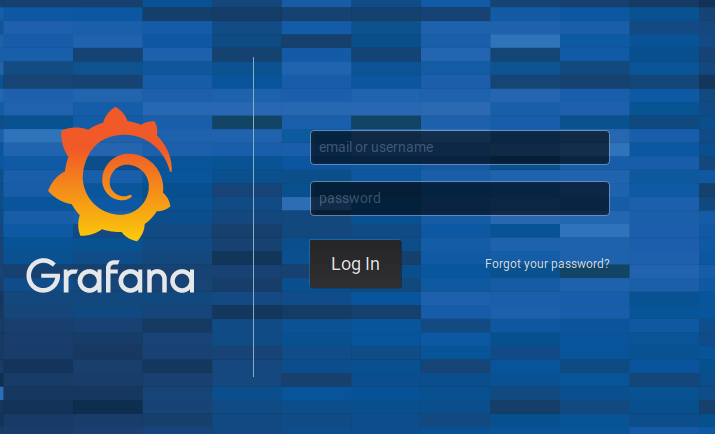
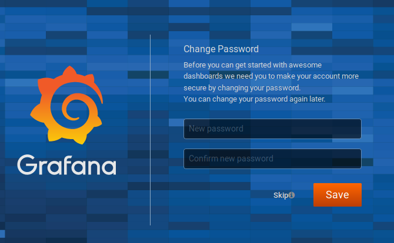
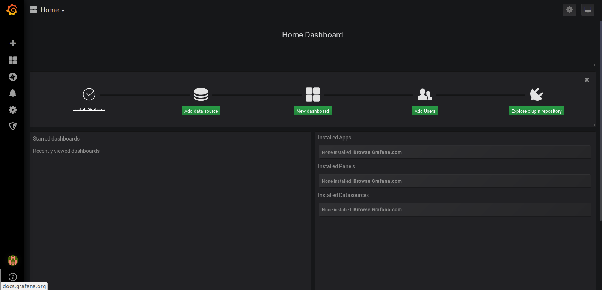

# Cài đặt cấu hình Grafafa 

Cài đặt 
```sh 
wget https://dl.grafana.com/oss/release/grafana-6.3.6-1.x86_64.rpm
sudo yum localinstall grafana-6.3.6-1.x86_64.rpm 
```

Khởi động 
```sh 
systemctl enable --now grafana-server
```



> Tài khoản mặc định `admin/admin`

Change passwd mới 



Màn hình ban đầu 



Allow firewall 
```sh 
firewall-cmd --add-port=3000/tcp --permanent
firewall-cmd --reload
```

# Các cấu hình cơ bản 


# Các Data Source thường dùng 

- Zabbix
- Prometheus 
- InfluxDB 

# Monitor Ceph RBD - OPS 

File [Json](tools/CEPH_Bandwidth.json)

# Monitor Ceph RadosGW


# Tài liệu tham khảo 
[1. https://grafana.com/grafana/download](https://grafana.com/grafana/download)