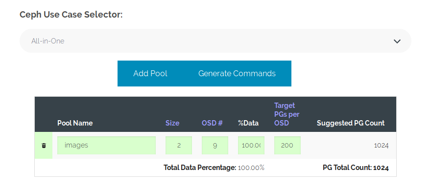

## Mount và sử dụng RBD images 

Mục tiêu: 
- Kết nối được Client vào cụm Ceph
- Thao tác cơ bản với extend dung lượng disk

## Chuẩn bị và môi trường LAB (4 Node)

- 1 cụm cài đặt Ceph 3 node
- Phiên bản cài đặt trong bài lab : [Ceph luminous](https://github.com/uncelvel/tutorial-ceph/blob/master/docs/setup/ceph-luminous-cephuser.md)
- 1 Node Ceph Client Cài đặt CentOS7

## Mô hình 

- Sử dụng mô hình
<p align="center">

</p>


## IP Planning

- Phân hoạch IP cho các máy chủ trong mô hình trên
<p align="center">

</p>


## Chuẩn bị đấu nối 

Trên node Ceph cài đặt Ceph-Client
```sh 
yum install ceph-common -y
```

> Yêu cầu Client có đấu nối trực tiếp vào network `ceph-public`

Đứng trên node Ceph, copy key và config sang node Client 
```sh 
cd /ceph-deploy
scp ceph.conf root@10.10.10.64:/etc/ceph/
scp ceph.client.admin.keyring root@10.10.10.64:/etc/ceph/
```
> ## Key admin là chúng ta sử dụng tạm thời

Đứng trên Node Client kiểm tra kết nối Ceph 
```sh 
ceph -s
```

## Tạo pool và images

Khỏi tạo pool cho cụm Ceph sử dụng [Công cụ](https://ceph.com/pgcalc/)



Sẽ gen ra 1 câu lệnh create như sau 
```sh 
## Note: The 'while' loops below pause between pools to allow all
##       PGs to be created.  This is a safety mechanism to prevent
##       saturating the Monitor nodes.
## -------------------------------------------------------------------

ceph osd pool create images 1024
ceph osd pool set images size 2
while [ $(ceph -s | grep creating -c) -gt 0 ]; do echo -n .;sleep 1; done
```

Kiểm tra 
```sh
ceph df
```

Tạo images tên là `volume01` trong pool `images`
```sh
rbd create images/volume01 --size 50G
rbd info images/volume01
```

## Cấu hình và start dịch vụ rbdmap

Đứng trên node `ceph01` thực hiện bỏ các feature của image 
```sh 
rbd feature disable images/volume01  exclusive-lock object-map fast-diff deep-flatten
```

Quay lại node `Client` bổ sung config rbdmap 
```sh 
echo "images/volume01            id=admin,keyring=/etc/ceph/ceph.client.admin.keyring" >> /etc/ceph/rbdmap
```

Enable mode hỗ trợ rbd
```sh
sudo modprobe rbd
```

Khởi động dịch vụ rbdmap
```sh 
systemctl start rbdmap && systemctl enable rbdmap
```

Kiểm tra images được mount theo câu lệnh 
```sh 
lsblk
```

## Sử dụng Block RBD được mount 

Đối với block `rbd0` được tạo chúng ta có thể sử dụng nó như một ổ đĩa bình thường 

- Format ext4
- Format lvm 
- ...

VD: Sử dụng `ext4` 

Tạo thư mục để lưu trữ 
```sh 
mkdir -p /data
```

Format disk 
```sh 
mkfs.ext4 -F /dev/rbd0
```

Mount `/dev/rbd0` vào folder vừa tạo
```sh 
mount /dev/rbd0 /data
```

Lấy ID của device `rbd0`
```sh 
blkid
```

Bổ sung `fstab` để tự động mount lúc khởi động
```sh 
echo "UUID=bfdf0e00-1d73-4bd9-a43e-32c408dbfdc9 /data ext4 noauto 0 0" >> /etc/fstab
```

> ## Lưu ý: chế độ để là `noauto` vì service rbdmap cần phải start OK thì mới thấy được ổ đĩa để mount 

Nếu sử dụng LVM thì cần bổ sung vào `lvm.conf` như sau 
```sh 
    # By default we accept every block device:
    types = [ "rbd", 1024 ]
```

## Hoàn tất bài lab
Chúng ta có thể sử dụng thêm các thao tác với images như snapshot....