# Thông tin Ceph-Dashboard 

Ceph Dashboard là một module trong services `MGR` của Ceph, mục đích ban đầu của modules này là cung cấp một giao diện trực quan để monitor trực quan hệ thống Ceph. Module này được quan tâm và phát triển khá nhanh theo từng giai đoạn

### **Trước bản Karen, Jewel ..**

https://www.virtualtothecore.com/en/monitor-a-ceph-cluster-with-ceph-dash/

Cách 1: Chạy script file
```sh
mkdir /cephdash
cd /cephdash/
ls
git clone https://github.com/Crapworks/ceph-dash.git
yum install -y python-pip
easy_install Jinja2
./ceph-dash/ceph-dash.py
```
> Chúng ta có thể dùng Supervisord để chạy service này 

Cách 1: Chạy như một virtualhost
```sh 
yum -y install httpd mod_wsgi mod_ssl
systemctl start httpd
systemctl enable httpd
cd /var/www/html
git clone https://github.com/Crapworks/ceph-dash.git
vi /etc/httpd/conf.d/cephdash.conf
    <VirtualHost *:80>
    ServerName ceph.cloudconnect.local
    
    RewriteEngine On
    RewriteCond %{REQUEST_URI} !^/server-status
    RewriteRule ^/?(.*) https://%{HTTP_HOST}/$1 [R,L]
    </VirtualHost>
    
    <VirtualHost *:443>
    ServerName ceph.cloudconnect.local
    
    WSGIDaemonProcess cephdash user=apache group=apache processes=1 threads=5
    WSGIScriptAlias / /var/www/html/ceph-dash/contrib/wsgi/cephdash.wsgi
    WSGIPassAuthorization On
    
    SSLEngine on
    SSLCertificateFile /etc/httpd/ssl/apache.crt
    SSLCertificateKeyFile /etc/httpd/ssl/apache.key
    
    <Directory /var/www/html/ceph-dash>
    WSGIProcessGroup cephdash
    WSGIApplicationGroup %{GLOBAL}
    Order allow,deny
    Allow from all
    </Directory>
    </VirtualHost>
mkdir /etc/httpd/ssl/
openssl req -x509 -nodes -days 365 -newkey rsa:2048 -keyout /etc/httpd/ssl/apache.key -out /etc/httpd/ssl/apache.crt
systemctl restart httpd.service
```

Bổ sung quyền read cho file keyring
```sh
chmod +r /etc/ceph/ceph.client.admin.keyring
```

<p align="center">
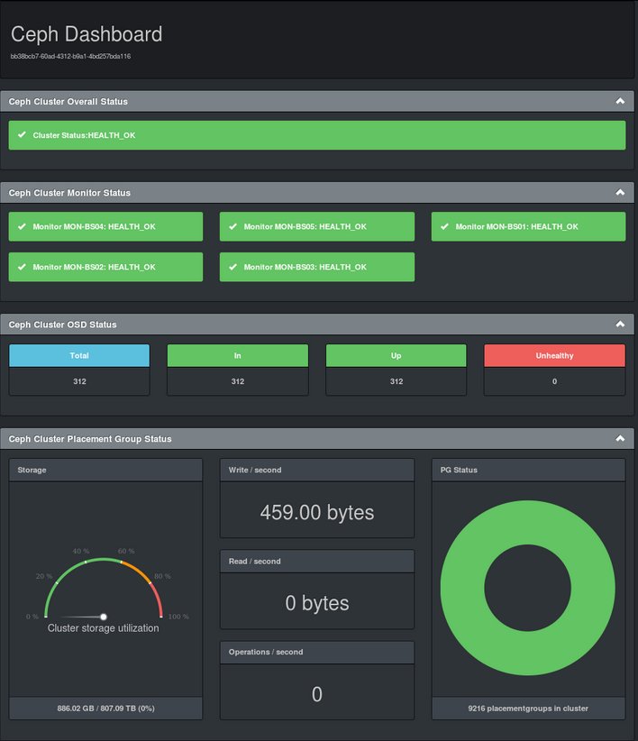
</p>

### **Bản Luminous:** 
Ở bản Luminous thì Services `Ceph-mgr` cũng là một serivce yêu cầu cài đặt khi khởi tạo cụm Ceph. Dashboard ở bản Ceph Luminous thường được gọi là `Dashboard v1` được tích hợp Stable trong service MGR chúng ta chỉ việc enable lên và sử dụng

Enable module dashboard
```sh 
ceph mgr module enable dashboard
ceph mgr services
```

Thông tin đường link đăng nhập
```sh
http://<ip-ceph01>:7000
```
<p align="center">

</p>

### **Bản Mimic: **
Hay còn gọi là `Dashboard v2` ở bản này CephDashboard đã kế thừa bộ Dashboard `openATTIC` từ SUSE tích hợp thêm phần require login 

Enable module dashboard
```sh 
ceph mgr module enable dashboard
ceph dashboard create-self-signed-cert
ceph dashboard set-login-credentials <username> <password>
ceph mgr services
```

Thông tin đường link đăng nhập
```sh
https://<ip-ceph01>:8443
```
<p align="center">
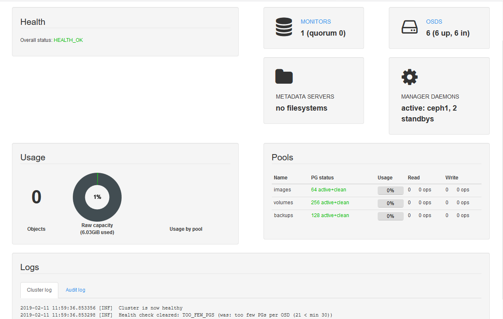
</p>

### **Bản Nautilus:**

Cài đặt và enable module dashboard
```sh
yum install ceph-mgr-dashboard -y
ceph mgr module enable dashboard
ceph dashboard create-self-signed-cert
ceph dashboard set-login-credentials <username> <password>
ceph mgr services
```

Thông tin đường link đăng nhập
```sh
https://<ip-ceph01>:8443
```
<p align="center">

</p>

## Các cập nhật mới trong bản Dashboard Nautilus

- Multi users/roles
- SSO (SAML v2)
- Auditing
- New landing page
- I18N
- Swagger REST API
- OSD management
- Config settings editor
- Ceph pool management
- EC Pool management
- RBD mirroring configuration
- Embedded Grafana Dashboard
- CRUSH map viewer
- NFS Ganesha management
- ISCSI target management
- RBD QoS configuration
- Prometheus Alert Management
- Ceph Manager Module Management

## Enable các tính năng trong trên Dashboard Nautilus

## Cluster 

<p align="center">
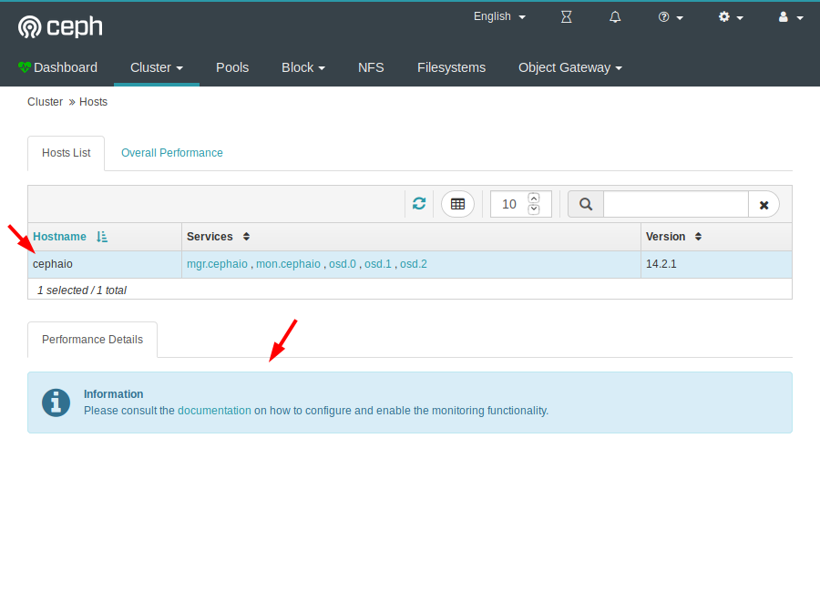
</p>

Enable module prometheus trên node MGR
```sh 
ceph mgr module enable prometheus
```

Kiểm tra 
```sh 
ceph mgr services
```
<p align="center">
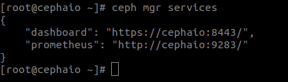
</p>

Truy cập exporter
<p align="center">

</p>

Để hiển thị được biểu đồ trên Dashboard thì chúng ta bổ sung thêm 1 node Grafana để collect và hiển thị toàn bộ metrics từ exporter này

<p align="center">
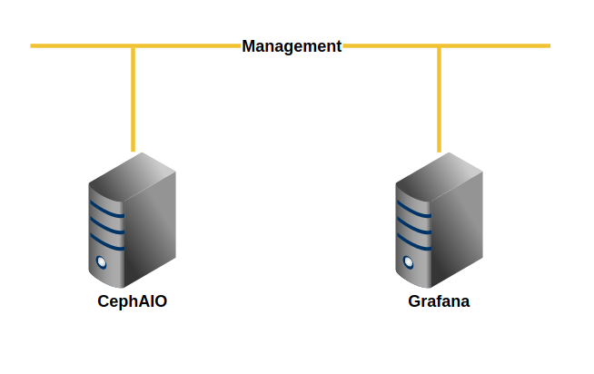
</p>

<p align="center">
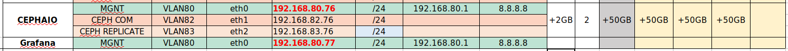
</p>

Cài đặt Grafana [TẠI ĐÂY](https://github.com/uncelvel/monitor/blob/master/grafana/docs/install.md)

Cấu hình trên node Ceph để 
```sh 
ceph dashboard set-grafana-api-url http://192.168.80.77:3000
```
<p align="center">
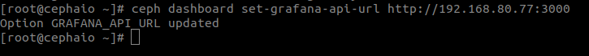
</p>


Login vào Grafana và chọn `Add datasource` 
<p align="center">
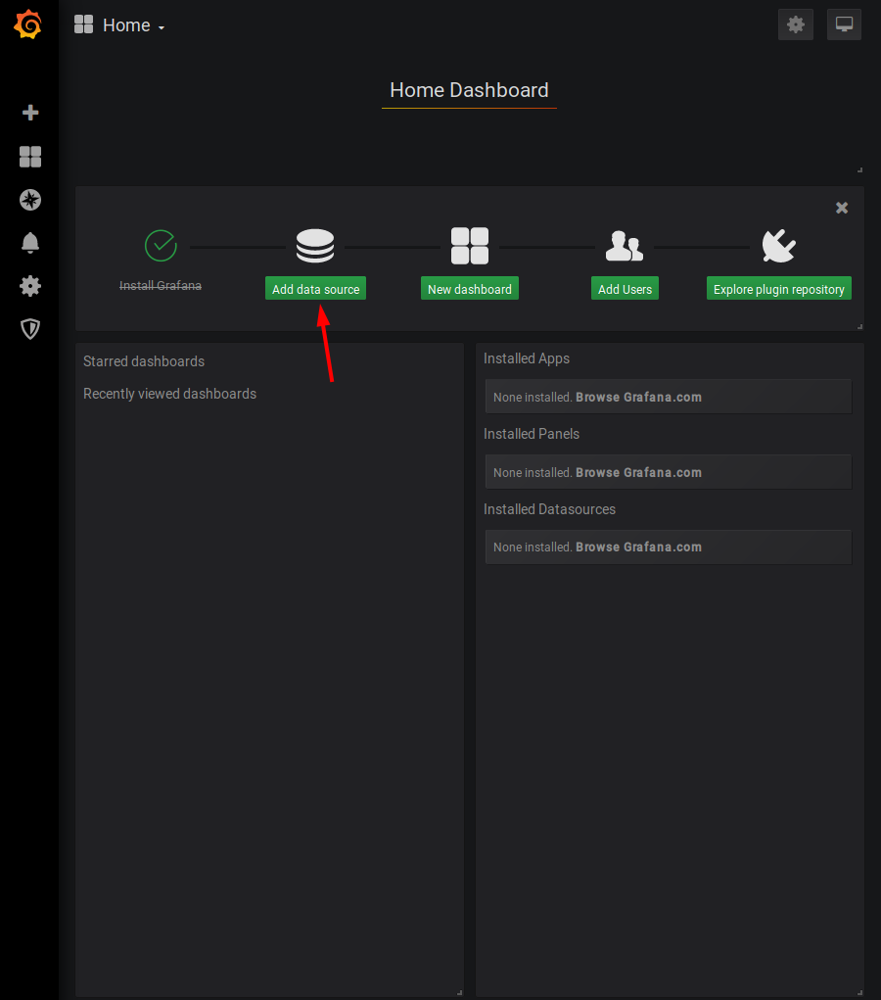
</p>

Chọn Datasource là `Prometheus`
<p align="center">
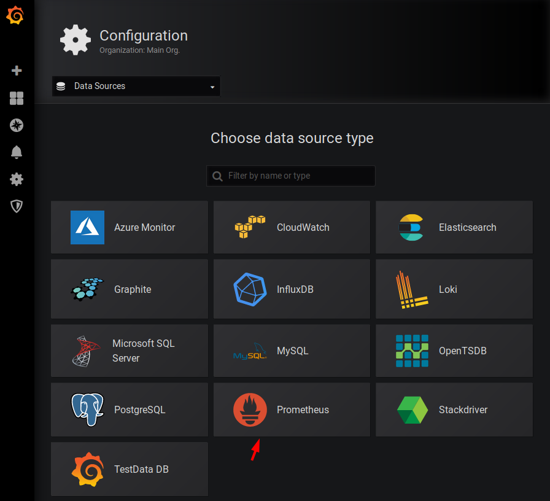
</p>

Điền thông tin exporter Prometheus của node Ceph và chọn `Save & Test`
<p align="center">
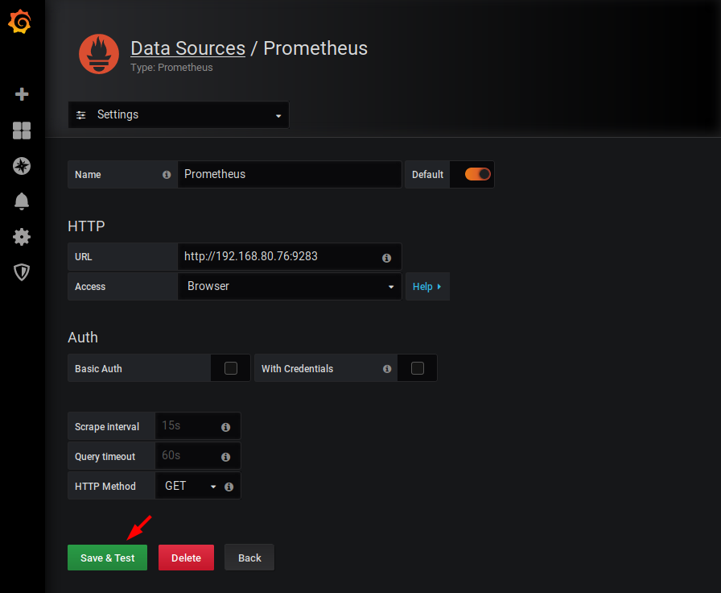
</p>

Hoàn tất add Datasource 
<p align="center">

</p>

Đăng nhập SSH vào node Grafana và cài đặt thêm Plugins
```sh 
grafana-cli plugins install vonage-status-panel
grafana-cli plugins install grafana-piechart-panel
```
<p align="center">
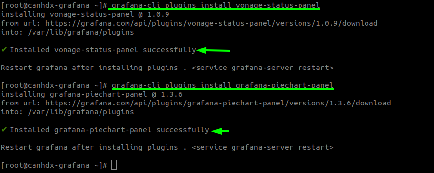
</p>


Cấu hình `/etc/grafana/grafana.ini` bật chế độ `anonymous`
```sh
[auth.anonymous]
enabled = true
org_name = Main Org.
org_role = Viewer
```
<p align="center">
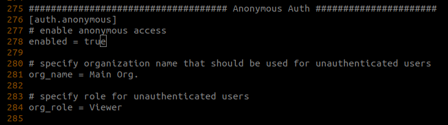
</p>

Restart grafana-server 
```sh 
systemctl restart grafana-server
```

Clone các file json cấu hình Dashboard từ trang chủ 
```sh 
https://github.com/ceph/ceph/tree/master/monitoring/grafana/dashboards
```

Quay lại Grafana Dashboard tiến hành import cấu hình Dashboard
<p align="center">
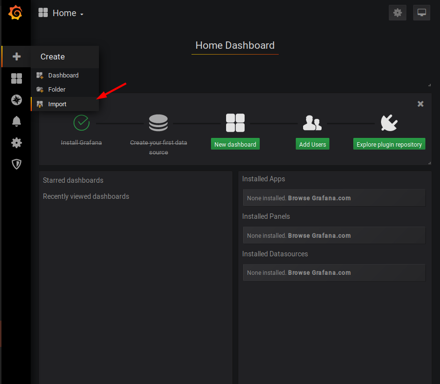
</p>


Templating init failed{"err":{"data":null,"status":-1,"config":{"method":"GET","transformRequest":[null],"transformResponse":[null],"jsonpCallbackParam":"callback","silent":true,"url":"http://192.168.80.76:9283/api/v1/series?match[]=ceph_health_status&start=1561929086&end=1561950686","headers":{"Accept":"application/json, text/plain, */*"},"retry":0},"statusText":"","xhrStatus":"error"},"cancelled":true}

## Tài liệu tham khảo 

http://docs.ceph.com/docs/nautilus/mgr/dashboard/#enabling-the-embedding-of-grafana-dashboards


ACC015642
103.101.160.82


103.28.39.217