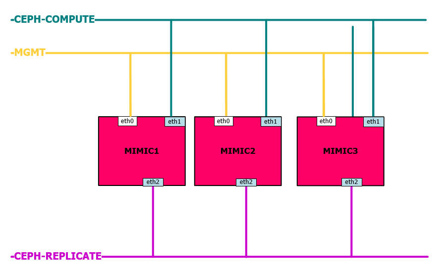
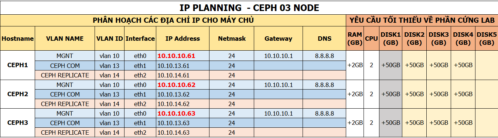

## Hướng dẫn cài đặt CEPH sử dụng `ceph-deploy`

### Mục tiêu LAB
- Mô hình này sử dụng 3 server, trong đó:
  - Host `mimic1` cài đặt `ceph-deploy`, `ceph-mon`,` ceph-osd`, `ceph-mgr`
  - Host `mimic2` cài đặt `ceph-osd`
  - Host `mimic3` cài đặt `ceph-osd`
- Mô hình khá cơ bản cho việc áp dụng vào môi trường Product

## Chuẩn bị và môi trường LAB (3 Node)

- OS
  - CentOS7 - 64 bit
  - 05: HDD, trong đó:
    - `vda`: sử dụng để cài OS
    - `vdb`: sử dụng làm OSD (nơi chứa dữ liệu của client)
  - 03 NICs: 
    - `eth0`: dùng để ssh và tải gói cài đặt
    - `eth1`: dùng để các trao đổi thông tin giữa các node Ceph, cũng là đường Client kết nối vào
    - `eth2`: dùng để đồng bộ dữ liệu giữa các OSD
  
- Phiên bản cài đặt : Ceph Mimic


## Mô hình 
- Sử dụng mô hình

    


## IP Planning
- Phân hoạch IP cho các máy chủ trong mô hình trên

    


## Các bước chuẩn bị trên từng Server

- Đặt hostname
    ```sh
    hostnamectl set-hostname mimic1
    ```

- Đặt IP cho các node
    ```sh 
    systemctl disable NetworkManager
    systemctl stop NetworkManager
    systemctl enable network
    systemctl start network

    echo "Setup IP eth0"
    nmcli c modify eth0 ipv4.addresses 10.10.10.61/24
    nmcli c modify eth0 ipv4.gateway 10.10.10.1
    nmcli c modify eth0 ipv4.dns 8.8.8.8
    nmcli c modify eth0 ipv4.method manual
    nmcli con mod eth0 connection.autoconnect yes

    echo "Setup IP eth1"
    nmcli c modify eth1 ipv4.addresses 10.10.13.61/24
    nmcli c modify eth1 ipv4.method manual
    nmcli con mod eth1 connection.autoconnect yes

    echo "Setup IP eth2"
    nmcli c modify eth2 ipv4.addresses 10.10.14.61/24
    nmcli c modify eth2 ipv4.method manual
    nmcli con mod eth2 connection.autoconnect yes
    ```

- Cài đặt epel-relese và update OS 
    ```sh
    yum install epel-release -y
    yum update -y
    ```

- Mở port cho Ceph trên Selinux
    ```sh 
    null
    ```

- Vô hiệu hóa Selinux
    ```sh
    sed -i 's/SELINUX=enforcing/SELINUX=disabled/g' /etc/sysconfig/selinux
    ```

- Mở port cho Ceph trên Firewalld  
    ```sh 
    null
    ```

- Disable firewall 
    ```sh 
    sudo systemctl disable firewalld
    sudo systemctl stop firewalld
    ```

- Bổ sung file hosts
    ```sh
    cat << EOF >> /etc/hosts
    10.10.13.61 mimic1
    10.10.13.62 mimic2
    10.10.13.63 mimic3
    EOF
    ```
    > Lưu ý network setup trong /etc/hosts chính là đường `eth1` dùng để các trao đổi thông tin giữa các node Ceph, cũng là đường Client kết nối vào

- Kiểm tra kết nối
    ```sh 
    ping -c 10 mimic1
    ```

- Khởi động lại máy
    ```sh
    init 6
    ```

> Các server Mimic2 và Mimic3 thực hiện tương tự

## Cài đặt Ceph 

Các bước ở dưới được thực hiện toàn toàn trên Node `mimic1`

- Cài đặt `ceph-deploy`
    ```sh 
    rpm -ivh https://download.ceph.com/rpm-mimic/el7/noarch/ceph-deploy-2.0.1-0.noarch.rpm
    ```

- Cài đặt `python-setuptools` để `ceph-deploy` có thể hoạt động ổn định
    ```sh 
    curl https://bootstrap.pypa.io/ez_setup.py | python
    ```

- Kiểm tra cài đặt 
    ```sh 
    ceph-deploy --version
    ```
    >Kết quả như sau là đã cài đặt thành công ceph-deploy
    ```sh 
    2.0.1
    ```

- Tạo ssh key 
    ```sh
    ssh-keygen
    ```
    > Bấm ENTER khi có requirement 

- Copy ssh key sang các node khác
    ```sh
    ssh-copy-id root@mimic1
    ssh-copy-id root@mimic2
    ssh-copy-id root@mimic3
  ```
  
- Tạo các thư mục `ceph-deploy` để thao tác cài đặt vận hành Cluster
    ```sh
    mkdir /ceph-deploy && cd /ceph-deploy
    ```

- Khởi tại file cấu hình cho cụm với node quản lý là `mimic1`
    ```sh
    ceph-deploy new mimic1
    ```

- Kiểm tra lại thông tin folder `ceph-deploy`
    ```sh 
    [root@mimic1 ceph-deploy]# ls -lah
    total 12K
    drwxr-xr-x   2 root root   75 Jan 31 16:31 .
    dr-xr-xr-x. 18 root root  243 Jan 31 16:29 ..
    -rw-r--r--   1 root root 2.9K Jan 31 16:31 ceph-deploy-ceph.log
    -rw-r--r--   1 root root  195 Jan 31 16:31 ceph.conf
    -rw-------   1 root root   73 Jan 31 16:31 ceph.mon.keyring
    [root@mimic1 ceph-deploy]#
    ```
    - `ceph.conf` : file config được tự động khởi tạo
    - `ceph-deploy-ceph.log` : file log của toàn bộ thao tác đối với việc sử dụng lệnh `ceph-deploy`
    - `ceph.mon.keyring` : Key monitoring được ceph sinh ra tự động để khởi tạo Cluster

- Chúng ta sẽ bổ sung thêm vào file `ceph.conf` một vài thông tin cơ bản như sau:
    ```sh
    cat << EOF >> /ceph-deploy/ceph.conf
    osd pool default size = 2
    osd pool default min size = 1
    osd crush chooseleaf type = 0
    osd pool default pg num = 128
    osd pool default pgp num = 128

    public network = 10.10.13.0/24
    cluster network = 10.10.14.0/24
    EOF
    ```
    - Bổ sung thêm định nghĩa 
        + `public network` : Đường trao đổi thông tin giữa các node Ceph và cũng là đường client kết nối vào 
        + `cluster network` : Đường đồng bộ dữ liệu
    - Bổ sung thêm `default size replicate`
    - Bổ sung thêm `default pg num`

  
- Cài đặt ceph trên toàn bộ các node ceph
    ```sh
    ceph-deploy install --release mimic mimic1 mimic2 mimic3 
    ```

- Kiểm tra sau khi cài đặt 
    ```sh 
    ceph -v 
    ```
    > Kết quả như sau là đã cài đặt thành công ceph trên node 
    ```sh 
    ceph version 13.2.4 (b10be4d44915a4d78a8e06aa31919e74927b142e) mimic (stable)
    ```

- Khởi tạo cluster với các node `mon` (Monitor-quản lý) dựa trên file `ceph.conf`
    ```sh
    ceph-deploy mon create-initial
    ```

- Sau khi thực hiện lệnh phía trên sẽ sinh thêm ra 05 file : `ceph.bootstrap-mds.keyring`, `ceph.bootstrap-mgr.keyring`, `ceph.bootstrap-osd.keyring`, `ceph.client.admin.keyring` và `ceph.bootstrap-rgw.keyring`. Quan sát bằng lệnh `ll -alh`

    ```sh
    [root@mimic1 ceph-deploy]# ls -lah
    total 348K
    drwxr-xr-x   2 root root  244 Feb  1 11:40 .
    dr-xr-xr-x. 18 root root  243 Feb  1 11:29 ..
    -rw-r--r--   1 root root 258K Feb  1 11:40 ceph-deploy-ceph.log
    -rw-------   1 root root  113 Feb  1 11:40 ceph.bootstrap-mds.keyring
    -rw-------   1 root root  113 Feb  1 11:40 ceph.bootstrap-mgr.keyring
    -rw-------   1 root root  113 Feb  1 11:40 ceph.bootstrap-osd.keyring
    -rw-------   1 root root  113 Feb  1 11:40 ceph.bootstrap-rgw.keyring
    -rw-------   1 root root  151 Feb  1 11:40 ceph.client.admin.keyring
    -rw-r--r--   1 root root  195 Feb  1 11:29 ceph.conf
    -rw-------   1 root root   73 Feb  1 11:29 ceph.mon.keyring
    ```

- Để node `mimic1` có thể thao tác với cluster chúng ta cần gán cho node `mimic1` với quyền admin bằng cách bổ sung cho node này `admin.keying`
    ```sh  
    ceph-deploy admin mimic1
    ```
    > Kiểm tra bằng lệnh 
    ```sh
    [root@mimic1 ceph-deploy]# ceph -s
    cluster:
        id:     691a39d3-0789-49db-bf54-c0e2a774901a
        health: HEALTH_OK

    services:
        mon: 1 daemons, quorum mimic1
        mgr: no daemons active
        osd: 0 osds: 0 up, 0 in

    data:
        pools:   0 pools, 0 pgs
        objects: 0  objects, 0 B
        usage:   0 B used, 0 B / 0 B avail
        pgs:
    ```

## Khởi tạo MGR

Ceph-mgr là thành phần cài đặt cần khởi tạo từ bản Luminous, có thể cài đặt trên nhiều node hoạt động theo cơ chế Active-Passive

- Cài đặt ceph-mgr trên mimic1
    ```sh
    ceph-deploy mgr create mimic1
    ```

- Kiểm tra cài đặt 
    ```sh
    [root@mimic1 ceph-deploy]# ceph -s
    cluster:
        id:     691a39d3-0789-49db-bf54-c0e2a774901a
        health: HEALTH_OK
    
    services:
        mon: 1 daemons, quorum mimic1
        mgr: mimic1(active)
        osd: 0 osds: 0 up, 0 in
    
     data:
        pools:   0 pools, 0 pgs
        objects: 0  objects, 0 B
        usage:   0 B used, 0 B / 0 B avail
        pgs:
    ```

- Ceph-mgr hỗ trợ dashboard để quan sát trạng thái của cluster, Enable mgr dashboard trên host mimic1
    ```sh
    ceph mgr module enable dashboard
    ```

- Truy cập vào mgr dashboard để kiểm tra

    http://<ip-mimic1>:7000

## Khởi tạo OSD

Tạo OSD thông qua ceph-deploy tại host mimic1

- Trên mimic1, dùng ceph-deploy để partition ổ cứng OSD, thay `mimic1` bằng hostname của host chứa OSD
    ```sh
    ceph-deploy disk zap mimic1:/dev/vdb
    ```

- Tạo OSD với ceph-deploy
    ```sh
    ceph-deploy osd create --data /dev/sdb mimic1
    ``` 

- Kiểm tra osd vừa tạo bằng lệnh
    ```sh
    ceph osd tree
    ``` 

- Kiểm tra ID của OSD bằng lệnh
    ```sh
    lsblk
    ```

    Kết quả:
    ```sh
    sdb                                                                                                     8:112  0   39G  0 disk  
    └─ceph--42804049--4734--4a87--b776--bfad5d382114-osd--data--e6346e12--c312--4ccf--9b5f--0efeb61d0144  253:5    0   39G  0 lvm   /var/lib/ceph/osd/ceph-0
    ```

## Kiểm tra
Thực hiện trên mimic1
- Kiểm tra trạng thái của CEPH sau khi cài
    ```sh
    ceph -s
    ```

- Kết quả của lệnh trên như sau: 
    ```sh
    ceph-deploy@mimic1:~/my-cluster$ ceph -s
    cluster:
        id:     691a39d3-0789-49db-bf54-c0e2a774901a
        health: HEALTH_OK
    
    services:
        mon: 1 daemons, quorum mimic1
        mgr: mimic1(active)
        osd: 3 osds: 3 up, 3 in
    
    data:
        pools:   0 pools, 0 pgs
        objects: 0 objects, 0 bytes
        usage:   3180 MB used, 116 GB / 119 GB avail
        pgs:     
    ```

- Nếu có dòng `health HEALTH_OK` thì việc cài đặt đã ok.
