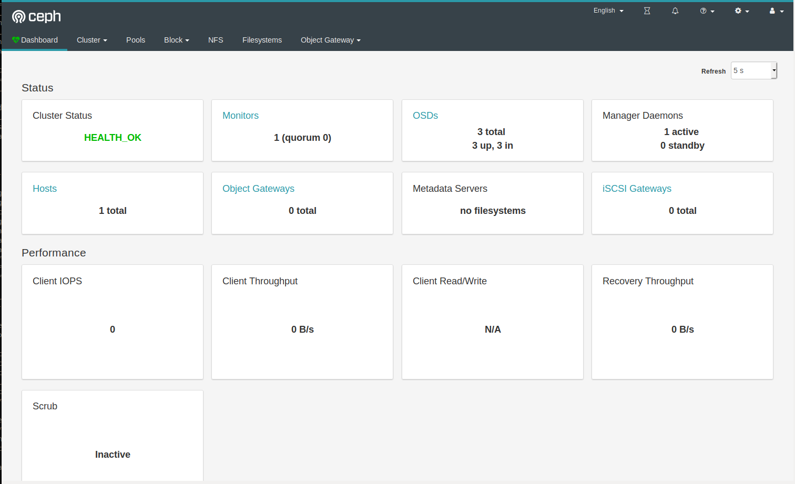

## Hướng dẫn cài đặt CEPH sử dụng `ceph-deploy`

### Mục tiêu LAB
- Mô hình này sử dụng 3 server, trong đó:
- Host `ceph01` cài đặt `ceph-deploy`, `ceph-mon`,` ceph-osd`, `ceph-mgr`
- Host `ceph02` cài đặt `ceph-osd`
- Host `ceph03` cài đặt `ceph-osd`
- Mô hình khá cơ bản cho việc áp dụng vào môi trường Product

## Chuẩn bị và môi trường LAB (3 Node)

- CentOS7 - 64 bit
- 03: HDD, trong đó:
    - `sda`: sử dụng để cài OS
    - `vdb`,`vdc`: sử dụng làm OSD (nơi chứa dữ liệu)
- 03 NICs: 
    - `eth0`: dùng để ssh và tải gói cài đặt
    - `eth1`: dùng để các trao đổi thông tin giữa các node Ceph, cũng là đường Client kết nối vào
    - `eth2`: dùng để đồng bộ dữ liệu giữa các OSD
- Phiên bản cài đặt : Ceph Nautilus


## Mô hình 
- Sử dụng mô hình


## IP Planning
- Phân hoạch IP cho các máy chủ trong mô hình trên


## Các bước chuẩn bị trên từng Server

- Cài đặt NTPD 
```sh 
yum install chrony -y 
```

- Enable NTPD 
```sh 
systemctl start chronyd 
systemctl enable chronyd 
```

- Kiểm tra chronyd hoạt động 
```sh 
chronyc sources -v 
timedatectl
```

- Set hwclock 
```sh 
hwclock --systohc
```

- Đặt hostname
```sh
hostnamectl set-hostname ceph01
```

- Đặt IP cho các node
```sh 
echo "Setup IP eth0"
nmcli c modify eth0 ipv4.addresses 10.10.10.61/24
nmcli c modify eth0 ipv4.gateway 10.10.10.1
nmcli c modify eth0 ipv4.dns 8.8.8.8
nmcli c modify eth0 ipv4.method manual
nmcli con mod eth0 connection.autoconnect yes

echo "Setup IP eth1"
nmcli c modify eth1 ipv4.addresses 10.10.13.61/24
nmcli c modify eth1 ipv4.method manual
nmcli con mod eth1 connection.autoconnect yes

echo "Setup IP eth2"
nmcli c modify eth2 ipv4.addresses 10.10.14.61/24
nmcli c modify eth2 ipv4.method manual
nmcli con mod eth2 connection.autoconnect yes

systemctl disable NetworkManager
systemctl enable network
systemctl start network
```

- Cài đặt epel-relese và update OS 
```sh
yum install epel-release -y
yum update -y
```

- Cài đặt CMD_log 
```sh 
curl -Lso- https://raw.githubusercontent.com/nhanhoadocs/scripts/master/Utilities/cmdlog.sh | bash
```
Hoặc
```sh
#!/bin/bash
echo "Install rsyslog"
yum -y install rsyslog || apt-get -y install rsyslog 
systemctl enable rsyslog.service || chkconfig rsyslog on
systemctl start rsyslog.service || service rsyslog start

echo "Config log History"
touch ~/.bash_profile
cp ~/{.bash_profile,.bash_profile.bk}
echo "export PROMPT_COMMAND='RETRN_VAL=$?;logger -p local6.debug \"[\$(echo \$SSH_CLIENT | cut -d\" \" -f1)] # \$(history 1 | sed \"s/^[ ]*[0-9]\+[ ]*//\" )\"'" >> ~/.bash_profile
echo 'export HISTTIMEFORMAT="%d/%m/%y %T "' >> ~/.bash_profile
touch /var/log/cmdlog.log

echo "Config rsyslog"
mv /etc/rsyslog.{conf,conf.bk}
cat >> /etc/rsyslog.conf << EOF
\$ModLoad imuxsock
\$ModLoad imklog
\$ActionFileDefaultTemplate RSYSLOG_TraditionalFileFormat
\$FileOwner root
\$FileGroup adm
\$FileCreateMode 0640
\$DirCreateMode 0755
\$Umask 0022
auth,authpriv.*-/var/log/auth.log
daemon.*-/var/log/daemon.log
kern.*-/var/log/kern.log
cron.*-/var/log/cron.log
user.*-/var/log/user.log
mail.*-/var/log/mail.log
local7.*-/var/log/boot.log
local6.*-/var/log/cmdlog.log
EOF

echo "Restart rsyslog"
systemctl restart  rsyslog.service || service rsyslog restart
source ~/.bash_profile
```

- Bổ sung user `cephuser`
```sh 
sudo useradd -d /home/cephuser -m cephuser
sudo passwd cephuser
````

- Cấp quyền sudo cho `cephuser`
```sh
echo "cephuser ALL = (root) NOPASSWD:ALL" | sudo tee /etc/sudoers.d/cephuser
sudo chmod 0440 /etc/sudoers.d/cephuser
```

- Vô hiệu hóa Selinux
```sh
sed -i 's/SELINUX=enforcing/SELINUX=disabled/g' /etc/sysconfig/selinux
sed -i 's/SELINUX=enforcing/SELINUX=disabled/g' /etc/selinux/config
```

- Mở port cho Ceph trên Firewalld  
```sh 
#ceph-admin
systemctl start firewalld
systemctl enable firewalld
sudo firewall-cmd --zone=public --add-port=80/tcp --permanent
sudo firewall-cmd --zone=public --add-port=2003/tcp --permanent
sudo firewall-cmd --zone=public --add-port=4505-4506/tcp --permanent
sudo firewall-cmd --reload

# mon
sudo systemctl start firewalld
sudo systemctl enable firewalld
sudo firewall-cmd --zone=public --add-port=6789/tcp --permanent
sudo firewall-cmd --reload

# osd
sudo systemctl start firewalld
sudo systemctl enable firewalld
sudo firewall-cmd --zone=public --add-port=6800-7300/tcp --permanent
sudo firewall-cmd --reload
```

- Hoặc có thể disable firewall 
```sh 
sudo systemctl disable firewalld
sudo systemctl stop firewalld
```

- Bổ sung file hosts
```sh
cat << EOF >> /etc/hosts
10.10.13.61 ceph01
10.10.13.62 ceph02
10.10.13.63 ceph03
EOF
```
> Lưu ý network setup trong /etc/hosts chính là đường `eth1` dùng để các trao đổi thông tin giữa các node Ceph, cũng là đường Client kết nối vào

- Kiểm tra kết nối
```sh 
ping -c 10 ceph01
```

- Khởi động lại máy
```sh
init 6
```

> Các server ceph02 và ceph03 thực hiện tương tự

## Cài đặt Ceph 

Bổ sung repo cho ceph trên tất cả các node
```sh 
cat <<EOF> /etc/yum.repos.d/ceph.repo
[ceph]
name=Ceph packages for $basearch
baseurl=https://download.ceph.com/rpm-nautilus/el7/x86_64/
enabled=1
priority=2
gpgcheck=1
gpgkey=https://download.ceph.com/keys/release.asc

[ceph-noarch]
name=Ceph noarch packages
baseurl=https://download.ceph.com/rpm-nautilus/el7/noarch
enabled=1
priority=2
gpgcheck=1
gpgkey=https://download.ceph.com/keys/release.asc

[ceph-source]
name=Ceph source packages
baseurl=https://download.ceph.com/rpm-nautilus/el7/SRPMS
enabled=0
priority=2
gpgcheck=1
gpgkey=https://download.ceph.com/keys/release.asc
EOF

yum update -y
```

Các bước ở dưới được thực hiện toàn toàn trên Node `ceph01`

- Cài đặt `python-setuptools`
```sh 
yum install python-setuptools -y
```

- Cài đặt `ceph-deploy`
```sh 
yum install ceph-deploy -y
```

- Kiểm tra cài đặt 
```sh 
ceph-deploy --version
```
>Kết quả như sau là đã cài đặt thành công ceph-deploy
```sh 
2.0.1
```

- Tạo ssh key 
```sh
ssh-keygen
```
> Bấm ENTER khi có requirement 

- Cấu hình user ssh cho ceph-deploy
```sh 
cat <<EOF> /root/.ssh/config
Host ceph01
    Hostname ceph01
    User cephuser
Host ceph02
    Hostname ceph02
    User cephuser
Host ceph03
    Hostname ceph03
    User cephuser
EOF
```

- Copy ssh key sang các node khác
```sh
ssh-copy-id ceph01
ssh-copy-id ceph02
ssh-copy-id ceph03
```
> Nhập mật khẩu

- Tạo các thư mục `ceph-deploy` để thao tác cài đặt vận hành Cluster
```sh
mkdir /ceph-deploy && cd /ceph-deploy
```

- Khởi tại file cấu hình cho cụm với node quản lý là `ceph01`
```sh
ceph-deploy new ceph01 ceph02 ceph03
```

- Kiểm tra lại thông tin folder `ceph-deploy`
```sh 
[root@ceph01 ceph-deploy]# ls -lah
total 12K
drwxr-xr-x   2 root root   75 Jan 31 16:31 .
dr-xr-xr-x. 18 root root  243 Jan 31 16:29 ..
-rw-r--r--   1 root root 2.9K Jan 31 16:31 ceph-deploy-ceph.log
-rw-r--r--   1 root root  195 Jan 31 16:31 ceph.conf
-rw-------   1 root root   73 Jan 31 16:31 ceph.mon.keyring
[root@ceph01 ceph-deploy]#
```
- `ceph.conf` : file config được tự động khởi tạo
- `ceph-deploy-ceph.log` : file log của toàn bộ thao tác đối với việc sử dụng lệnh `ceph-deploy`
- `ceph.mon.keyring` : Key monitoring được ceph sinh ra tự động để khởi tạo Cluster

- Chúng ta sẽ bổ sung thêm vào file `ceph.conf` một vài thông tin cơ bản như sau:
```sh
cat << EOF >> ceph.conf
osd pool default size = 2
osd pool default min size = 1
osd pool default pg num = 128
osd pool default pgp num = 128

osd crush chooseleaf type = 1

public network = 10.10.13.0/24
cluster network = 10.10.14.0/24
EOF
```
- Bổ sung thêm định nghĩa 
    + `public network` : Đường trao đổi thông tin giữa các node Ceph và cũng là đường client kết nối vào 
    + `cluster network` : Đường đồng bộ dữ liệu
- Bổ sung thêm `default size replicate`
- Bổ sung thêm `default pg num`


- Cài đặt ceph trên toàn bộ các node ceph
```sh
ceph-deploy install --release nautilus ceph01 ceph02 ceph03 
```

- Kiểm tra sau khi cài đặt trên cả 3 node
```sh 
ceph -v 
```
> Kết quả như sau là đã cài đặt thành công ceph trên node 
```sh 
 ceph version 14.2.2 (4f8fa0a0024755aae7d95567c63f11d6862d55be) nautilus (stable)
```

- Khởi tạo cluster với các node `mon` (Monitor-quản lý) dựa trên file `ceph.conf`
```sh
ceph-deploy mon create-initial
```

- Sau khi thực hiện lệnh phía trên sẽ sinh thêm ra 05 file : 
`ceph.bootstrap-mds.keyring`, `ceph.bootstrap-mgr.keyring`, `ceph.bootstrap-osd.keyring`, `ceph.client.admin.keyring` và `ceph.bootstrap-rgw.keyring`. Quan sát bằng lệnh `ll -alh`

```sh
[root@ceph01 ceph-deploy]# ls -lah
total 348K
drwxr-xr-x   2 root root  244 Feb  1 11:40 .
dr-xr-xr-x. 18 root root  243 Feb  1 11:29 ..
-rw-r--r--   1 root root 258K Feb  1 11:40 ceph-deploy-ceph.log
-rw-------   1 root root  113 Feb  1 11:40 ceph.bootstrap-mds.keyring
-rw-------   1 root root  113 Feb  1 11:40 ceph.bootstrap-mgr.keyring
-rw-------   1 root root  113 Feb  1 11:40 ceph.bootstrap-osd.keyring
-rw-------   1 root root  113 Feb  1 11:40 ceph.bootstrap-rgw.keyring
-rw-------   1 root root  151 Feb  1 11:40 ceph.client.admin.keyring
-rw-r--r--   1 root root  195 Feb  1 11:29 ceph.conf
-rw-------   1 root root   73 Feb  1 11:29 ceph.mon.keyring
```

- Để node `ceph01`, `ceph02`, `ceph03` có thể thao tác với cluster chúng ta cần gán cho node quyền admin bằng cách bổ sung key `admin.keying` cho node
```sh  
ceph-deploy admin ceph01 ceph02 ceph03
```
> Kiểm tra bằng lệnh 
```sh
[root@ceph01 ceph-deploy]# ceph -s 
  cluster:
    id:     ba7c7fa1-4e55-450b-bc40-4cf122b28c27
    health: HEALTH_OK
 
  services:
    mon: 3 daemons, quorum ceph01,ceph02,ceph03 (age 1.09337s)
    mgr: no daemons active
    osd: 0 osds: 0 up, 0 in
 
  data:
    pools:   0 pools, 0 pgs
    objects: 0 objects, 0 B
    usage:   0 B used, 0 B / 0 B avail
    pgs:     
```

## Khởi tạo MGR

Ceph-mgr là thành phần cài đặt yêu cầu cần khởi tạo từ bản luminous, có thể cài đặt trên nhiều node hoạt động theo cơ chế `Active-Passive`

- Cài đặt ceph-mgr trên ceph01
```sh
ceph-deploy mgr create ceph01 ceph02
```

- Kiểm tra cài đặt 
```sh
[root@ceph01 ceph-deploy]# ceph -s 
  cluster:
    id:     ba7c7fa1-4e55-450b-bc40-4cf122b28c27
    health: HEALTH_OK
 
  services:
    mon: 3 daemons, quorum ceph01,ceph02,ceph03 (age 53s)
    mgr: ceph01(active, since 11s), standbys: ceph02
    osd: 0 osds: 0 up, 0 in
 
  data:
    pools:   0 pools, 0 pgs
    objects: 0 objects, 0 B
    usage:   0 B used, 0 B / 0 B avail
    pgs:     
```

- Ceph-mgr hỗ trợ dashboard để quan sát trạng thái của cluster, Enable mgr dashboard trên host ceph01
```sh
yum install ceph-mgr-dashboard -y
ceph mgr module enable dashboard
ceph dashboard create-self-signed-cert
ceph dashboard set-login-credentials <username> <password>
ceph mgr services
```

> Lưu ý cài đặt `yum install ceph-mgr-dashboard -y` trên cả `ceph01` và `ceph02` 

- Truy cập vào mgr dashboard với username và password vừa đặt ở phía trên để kiểm tra
```sh 
https://<ip-ceph01>:8443
```



## Khởi tạo OSD

Tạo OSD thông qua ceph-deploy tại host `ceph01`

- Thực hiện zapdisk 
```sh
ceph-deploy disk zap ceph01 /dev/vdb
ceph-deploy disk zap ceph01 /dev/vdc
```

- Tạo OSD với ceph-deploy
```sh
ceph-deploy osd create --data /dev/vdb ceph01
ceph-deploy osd create --data /dev/vdc ceph01
``` 

- Thao tác với các ổ trên `ceph02` và `ceph03` tương tự. Vẫn thực hiện trên thư mục `ceph-deploy` trên `ceph01`
```sh 
# ceph02 
ceph-deploy disk zap ceph02 /dev/vdb
ceph-deploy disk zap ceph02 /dev/vdc
ceph-deploy osd create --data /dev/vdb ceph02
ceph-deploy osd create --data /dev/vdc ceph02

# ceph03
ceph-deploy disk zap ceph03 /dev/vdb
ceph-deploy disk zap ceph03 /dev/vdc
ceph-deploy osd create --data /dev/vdb ceph03
ceph-deploy osd create --data /dev/vdc ceph03
```

- Kiểm tra osd vừa tạo bằng lệnh
```sh
ceph osd tree
``` 
- Kết quả 
```sh 
[root@ceph01 ceph-deploy]# ceph osd tree 
ID CLASS WEIGHT  TYPE NAME       STATUS REWEIGHT PRI-AFF 
-1       0.16974 root default                            
-3       0.05658     host ceph01                         
 0   hdd 0.02829         osd.0       up  1.00000 1.00000 
 1   hdd 0.02829         osd.1       up  1.00000 1.00000 
-5       0.05658     host ceph02                         
 2   hdd 0.02829         osd.2       up  1.00000 1.00000 
 3   hdd 0.02829         osd.3       up  1.00000 1.00000 
-7       0.05658     host ceph03                         
 4   hdd 0.02829         osd.4       up  1.00000 1.00000 
 5   hdd 0.02829         osd.5       up  1.00000 1.00000 
```

## Kiểm tra
Thực hiện trên ceph01
- Kiểm tra trạng thái của CEPH sau khi cài
```sh
ceph -s
```

- Kết quả của lệnh trên như sau: 
```sh
[root@ceph01 ceph-deploy]# ceph -s
  cluster:
    id:     ba7c7fa1-4e55-450b-bc40-4cf122b28c27
    health: HEALTH_OK
 
  services:
    mon: 3 daemons, quorum ceph01,ceph02,ceph03 (age 10m)
    mgr: ceph01(active, since 7m), standbys: ceph02
    osd: 6 osds: 6 up (since 51s), 6 in (since 51s)
 
  data:
    pools:   0 pools, 0 pgs
    objects: 0 objects, 0 B
    usage:   6.0 GiB used, 168 GiB / 174 GiB avail
    pgs:          
```

- Nếu có dòng `health HEALTH_OK` thì việc cài đặt đã ok.
