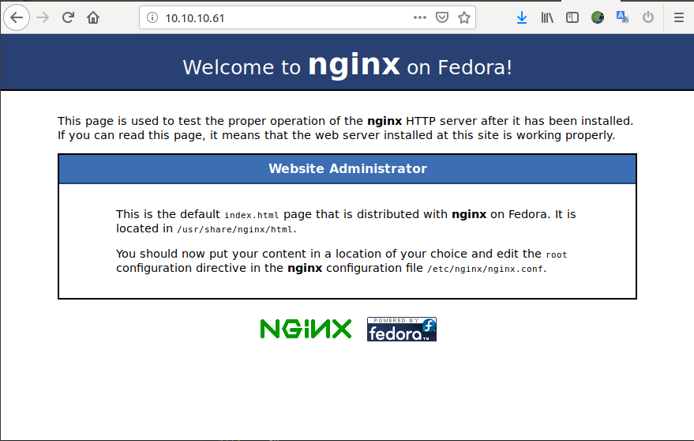
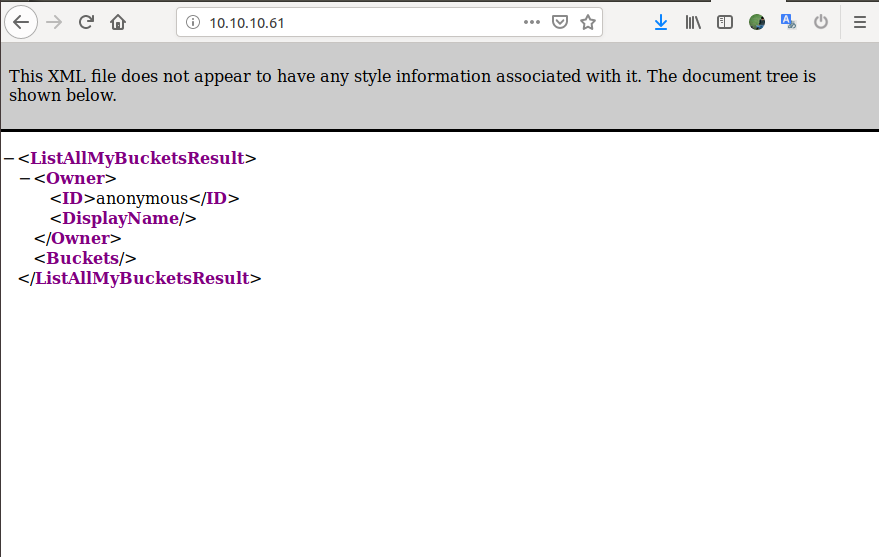
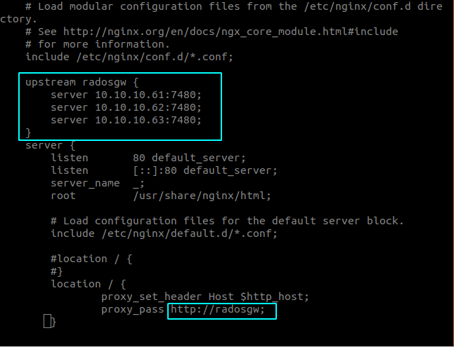
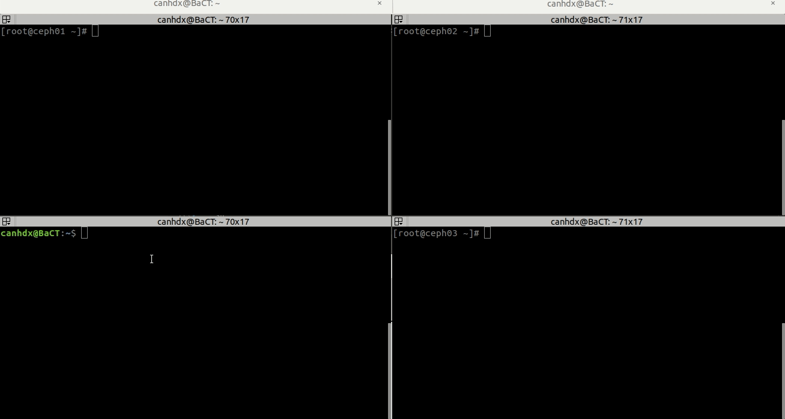

# Ceph Object Storage - Ceph RadosGW 

## Cài đặt mô hình 

Cài đặt theo [tài liệu](ceph-nautilus.md)

## Cài đặt Ceph RadosGW 
http://docs.ceph.com/docs/mimic/install/install-ceph-gateway/


Khởi tạo node `rgw` trên cả 3 node ceph 
```sh 
cd /ceph-deploy
ceph-deploy install --rgw ceph01 ceph02 ceph03
ceph-deploy rgw create ceph01 ceph02 ceph03 
```

Ceph Object Gateway được chạy trên Civetweb (được tích hợp sẵn trong ceph-radosgw daemon) bao gồm Apache và FastCGI. Civetweb của RGW chạy dưới port 7480

Cài đặt net-tools 
```sh 
yum install net-tools -y
```

Kiểm tra trên tất cả các node:
```sh 
[root@ceph01 ~]# netstat -tnlp | grep 7480
tcp        0      0 0.0.0.0:7480            0.0.0.0:*               LISTEN      14030/radosgw       
[root@ceph01 ~]#
```

Kiểm tra pool default 
```sh 
[root@ceph01 ~]# ceph df 
RAW STORAGE:
    CLASS     SIZE        AVAIL       USED       RAW USED     %RAW USED 
    hdd       174 GiB     168 GiB     29 MiB      6.0 GiB          3.46 
    TOTAL     174 GiB     168 GiB     29 MiB      6.0 GiB          3.46 
 
POOLS:
    POOL          ID     STORED     OBJECTS     USED     %USED     MAX AVAIL 
    .rgw.root      1        0 B           0      0 B         0        80 GiB 
[root@ceph01 ~]# 
```


## Cấu hình index pool sử dụng SSD nhằm tăng tốc độ truy vấn

Các bước thực hiện 
- Xóa pool `.rgw.root` mặc định 
- Tạo các pool cho RGW theo ceph.com/pgcalc
- Chỉnh sửa config `crush_update_on_start = false`
- Bổ sung thêm disk, tạo mới OSD giả lập ssd bằng cách chỉnh class (Môi trường lab)
- Tạo rules cho các disk SSD 
- Di chuyển pool `default.rgw.buckets.index` sang SSD 
- Hoàn tất 

Bổ sung config cho phép xóa pool 
```sh 
cat << EOF >> ceph.conf

mon_allow_pool_delete = true
EOF
```

Push config sang các node 
```sh 
ceph-deploy --overwrite-conf config push ceph01 ceph02 ceph03
```

Thực hiện restart lại ceph-mon service trên toàn bộ các node 
```sh 
systemctl restart ceph-mon@$(hostname)
```
> Lưu ý thao tác restart này cần thực hiện trên toàn bộ các Node

Xoá pool `.rgw.root`
```sh 
ceph osd pool delete .rgw.root .rgw.root --yes-i-really-really-mean-it
```

Kiểm tra các OSD hiện có 
```sh 
[root@ceph01 ceph-deploy]# ceph osd tree 
ID CLASS WEIGHT  TYPE NAME       STATUS REWEIGHT PRI-AFF 
-1       0.16974 root default                            
-3       0.05658     host ceph01                         
 0   hdd 0.02829         osd.0       up  1.00000 1.00000 
 1   hdd 0.02829         osd.1       up  1.00000 1.00000 
-5       0.05658     host ceph02                         
 2   hdd 0.02829         osd.2       up  1.00000 1.00000 
 3   hdd 0.02829         osd.3       up  1.00000 1.00000 
-7       0.05658     host ceph03                         
 4   hdd 0.02829         osd.4       up  1.00000 1.00000 
 5   hdd 0.02829         osd.5       up  1.00000 1.00000 
```

Tạo pool dựa theo https://ceph.com/pgcalc


```sh 
ceph osd pool create .rgw.root 8
ceph osd pool create default.rgw.control 8
ceph osd pool create default.rgw.data.root 8
ceph osd pool create default.rgw.gc 8
ceph osd pool create default.rgw.log 8
ceph osd pool create default.rgw.intent-log 8
ceph osd pool create default.rgw.meta 8
ceph osd pool create default.rgw.usage 8
ceph osd pool create default.rgw.users.keys 8
ceph osd pool create default.rgw.users.email 8
ceph osd pool create default.rgw.users.swift 8
ceph osd pool create default.rgw.users.uid 8
ceph osd pool create default.rgw.buckets.extra 8
ceph osd pool create default.rgw.buckets.index 16
ceph osd pool create default.rgw.buckets.data 512
```

Enable application cho các pool vừa tạo
```sh 
ceph osd pool application enable .rgw.root                  rgw
ceph osd pool application enable default.rgw.control        rgw
ceph osd pool application enable default.rgw.data.root      rgw
ceph osd pool application enable default.rgw.gc             rgw
ceph osd pool application enable default.rgw.log            rgw
ceph osd pool application enable default.rgw.intent-log     rgw
ceph osd pool application enable default.rgw.meta           rgw
ceph osd pool application enable default.rgw.usage          rgw
ceph osd pool application enable default.rgw.users.keys     rgw
ceph osd pool application enable default.rgw.users.email    rgw
ceph osd pool application enable default.rgw.users.swift    rgw
ceph osd pool application enable default.rgw.users.uid      rgw
ceph osd pool application enable default.rgw.buckets.extra  rgw
ceph osd pool application enable default.rgw.buckets.index  rgw
ceph osd pool application enable default.rgw.buckets.data   rgw
```

Bổ sung config không cho phép tự động cập nhật crushmap
```sh 
cat << EOF >> ceph.conf

osd_crush_update_on_start = false
EOF
```

Push config sang các node 
```sh 
ceph-deploy --overwrite-conf config push ceph01 ceph02 ceph03
```

Thực hiện restart lại ceph-mon service trên toàn bộ các node 
```sh 
systemctl restart ceph-mon@$(hostname)
```
> Lưu ý thao tác restart này cần thực hiện trên toàn bộ các Node

Kiểm tra disk `/dev/vdd` là ổ SSD sử dụng cho `index pool` trên cả 3 node 
```sh 
[root@ceph01 ceph-deploy]# lsblk 
NAME                                                           MAJ:MIN RM  SIZE RO TYPE MOUNTPOINT
sr0                                                             11:0    1 1024M  0 rom  
vda                                                            253:0    0   30G  0 disk 
└─vda1                                                         253:1    0   30G  0 part /
vdb                                                            253:16   0   30G  0 disk 
└─ceph--8baf95af--6fba--4e29--b44d--55746f410d2e-osd--block--4b88cc49--1bad--415b--b904--ab41e0827313
                                                               252:1    0   29G  0 lvm  
vdc                                                            253:32   0   30G  0 disk 
└─ceph--03f23ab3--15ae--41d6--ae88--a0c7915dc354-osd--block--8945f962--71b4--482a--9aa3--8d53a166443b
                                                               252:0    0   29G  0 lvm  
vdd                                                            253:48   0   30G  0 disk 
```

Tạo mới OSD
```sh 
ceph-deploy disk zap ceph01 /dev/vdd
ceph-deploy disk zap ceph02 /dev/vdd
ceph-deploy disk zap ceph03 /dev/vdd
ceph-deploy osd create --data /dev/vdd ceph01
ceph-deploy osd create --data /dev/vdd ceph02
ceph-deploy osd create --data /dev/vdd ceph03
```

Kiểm tra các OSD mới tạo 
```sh
[root@ceph01 ~]# ceph osd tree 
ID CLASS WEIGHT  TYPE NAME       STATUS REWEIGHT PRI-AFF 
-1       0.16974 root default                            
-3       0.05658     host ceph01                         
 0   hdd 0.02829         osd.0     down  1.00000 1.00000 
 1   hdd 0.02829         osd.1     down  1.00000 1.00000 
-5       0.05658     host ceph02                         
 2   hdd 0.02829         osd.2     down  1.00000 1.00000 
 3   hdd 0.02829         osd.3     down  1.00000 1.00000 
-7       0.05658     host ceph03                         
 4   hdd 0.02829         osd.4     down  1.00000 1.00000 
 5   hdd 0.02829         osd.5     down  1.00000 1.00000 
 6   hdd       0 osd.6               up  1.00000 1.00000 
 7   hdd       0 osd.7               up  1.00000 1.00000 
 8   hdd       0 osd.8               up  1.00000 1.00000 
[root@ceph01 ~]# 
```

Thay đổi CLASS của disk giả lập SSD
```sh 
ceph osd crush rm-device-class osd.6
ceph osd crush rm-device-class osd.7
ceph osd crush rm-device-class osd.8
ceph osd crush set-device-class ssd osd.6
ceph osd crush set-device-class ssd osd.7
ceph osd crush set-device-class ssd osd.8
```

Kiểm tra class sau khi tạo mới 
```sh 
[root@ceph01 ~]# ceph osd tree 
ID CLASS WEIGHT  TYPE NAME       STATUS REWEIGHT PRI-AFF 
-1       0.16974 root default                            
-3       0.05658     host ceph01                         
 0   hdd 0.02829         osd.0     down  1.00000 1.00000 
 1   hdd 0.02829         osd.1     down  1.00000 1.00000 
-5       0.05658     host ceph02                         
 2   hdd 0.02829         osd.2     down  1.00000 1.00000 
 3   hdd 0.02829         osd.3     down  1.00000 1.00000 
-7       0.05658     host ceph03                         
 4   hdd 0.02829         osd.4     down  1.00000 1.00000 
 5   hdd 0.02829         osd.5     down  1.00000 1.00000 
 6   ssd       0 osd.6               up  1.00000 1.00000 
 7   ssd       0 osd.7               up  1.00000 1.00000 
 8   ssd       0 osd.8               up  1.00000 1.00000 
```

Kiểm tra các rule hiện có 
```sh 
ceph osd crush rule ls
```

Kết quả 
```sh 
replicated_rule
```

Dump chi tiết của 1 rule
```sh 
[root@ceph01 ~]# ceph osd crush rule dump
[
    {
        "rule_id": 0,
        "rule_name": "replicated_rule",
        "ruleset": 0,
        "type": 1,
        "min_size": 1,
        "max_size": 10,
        "steps": [
            {
                "op": "take",
                "item": -1,
                "item_name": "default"
            },
            {
                "op": "chooseleaf_firstn",
                "num": 0,
                "type": "host"
            },
            {
                "op": "emit"
            }
        ]
    }
]
```

Mặc định các pool được tạo sẽ sử dụng rule `replicated_rule` với `rule_id:0` 
```sh 
[root@ceph01 ~]# ceph osd pool ls detail
pool 69 '.rgw.root' replicated size 2 min_size 1 crush_rule 0 object_hash rjenkins pg_num 4 pgp_num 4 autoscale_mode warn last_change 517 flags hashpspool stripe_width 0 application rgw
pool 70 'default.rgw.control' replicated size 2 min_size 1 crush_rule 0 object_hash rjenkins pg_num 4 pgp_num 4 autoscale_mode warn last_change 518 flags hashpspool stripe_width 0 application rgw
pool 71 'default.rgw.data.root' replicated size 2 min_size 1 crush_rule 0 object_hash rjenkins pg_num 4 pgp_num 4 autoscale_mode warn last_change 472 flags hashpspool stripe_width 0
pool 72 'default.rgw.gc' replicated size 2 min_size 1 crush_rule 0 object_hash rjenkins pg_num 4 pgp_num 4 autoscale_mode warn last_change 475 flags hashpspool stripe_width 0
pool 73 'default.rgw.log' replicated size 2 min_size 1 crush_rule 0 object_hash rjenkins pg_num 4 pgp_num 4 autoscale_mode warn last_change 519 flags hashpspool stripe_width 0 application rgw
pool 74 'default.rgw.intent-log' replicated size 2 min_size 1 crush_rule 0 object_hash rjenkins pg_num 4 pgp_num 4 autoscale_mode warn last_change 482 flags hashpspool stripe_width 0
pool 75 'default.rgw.meta' replicated size 2 min_size 1 crush_rule 0 object_hash rjenkins pg_num 4 pgp_num 4 autoscale_mode warn last_change 520 flags hashpspool stripe_width 0 application rgw
pool 76 'default.rgw.usage' replicated size 2 min_size 1 crush_rule 0 object_hash rjenkins pg_num 4 pgp_num 4 autoscale_mode warn last_change 489 flags hashpspool stripe_width 0
pool 77 'default.rgw.users.keys' replicated size 2 min_size 1 crush_rule 0 object_hash rjenkins pg_num 4 pgp_num 4 autoscale_mode warn last_change 492 flags hashpspool stripe_width 0
pool 78 'default.rgw.users.email' replicated size 2 min_size 1 crush_rule 0 object_hash rjenkins pg_num 4 pgp_num 4 autoscale_mode warn last_change 495 flags hashpspool stripe_width 0
pool 79 'default.rgw.users.swift' replicated size 2 min_size 1 crush_rule 0 object_hash rjenkins pg_num 4 pgp_num 4 autoscale_mode warn last_change 499 flags hashpspool stripe_width 0
pool 80 'default.rgw.users.uid' replicated size 2 min_size 1 crush_rule 0 object_hash rjenkins pg_num 4 pgp_num 4 autoscale_mode warn last_change 502 flags hashpspool stripe_width 0
pool 81 'default.rgw.buckets.extra' replicated size 2 min_size 1 crush_rule 0 object_hash rjenkins pg_num 4 pgp_num 4 autoscale_mode warn last_change 506 flags hashpspool stripe_width 0
pool 82 'default.rgw.buckets.index' replicated size 2 min_size 1 crush_rule 0 object_hash rjenkins pg_num 4 pgp_num 4 autoscale_mode warn last_change 521 flags hashpspool stripe_width 0 application rgw
pool 83 'default.rgw.buckets.data' replicated size 2 min_size 1 crush_rule 0 object_hash rjenkins pg_num 128 pgp_num 128 autoscale_mode warn last_change 522 flags hashpspool stripe_width 0 application rgw
pool 84 'default.rgw.buckets.non-ec' replicated size 3 min_size 1 crush_rule 0 object_hash rjenkins pg_num 256 pgp_num 256 autoscale_mode warn last_change 516 flags hashpspool stripe_width 0 application rgw
```

Tạo mới một bucket root để cấu hình replicate 
```sh 
ceph osd crush add-bucket ssd_disk root
```

Kiểm tra 
```sh 
[root@ceph01 ~]# ceph osd tree 
ID  CLASS WEIGHT  TYPE NAME       STATUS REWEIGHT PRI-AFF 
-13             0 root ssd_disk                           
 -1       0.16974 root default                            
 -3       0.05658     host ceph01                         
  0   hdd 0.02829         osd.0     down  1.00000 1.00000 
  1   hdd 0.02829         osd.1     down  1.00000 1.00000 
 -5       0.05658     host ceph02                         
  2   hdd 0.02829         osd.2     down  1.00000 1.00000 
  3   hdd 0.02829         osd.3     down  1.00000 1.00000 
 -7       0.05658     host ceph03                         
  4   hdd 0.02829         osd.4     down  1.00000 1.00000 
  5   hdd 0.02829         osd.5     down  1.00000 1.00000 
  6   ssd       0 osd.6               up  1.00000 1.00000 
  7   ssd       0 osd.7               up  1.00000 1.00000 
  8   ssd       0 osd.8               up  1.00000 1.00000 
```

Create rule mới cho các ổ SSD 
```sh 
ceph osd crush rule create-replicated ssd_rule ssd_disk host
```

Dump rule để kiểm tra 
```sh 
[root@ceph01 ~]# ceph osd crush rule dump
[
    {
        "rule_id": 0,
        "rule_name": "replicated_rule",
        "ruleset": 0,
        "type": 1,
        "min_size": 1,
        "max_size": 10,
        "steps": [
            {
                "op": "take",
                "item": -1,
                "item_name": "default"
            },
            {
                "op": "chooseleaf_firstn",
                "num": 0,
                "type": "host"
            },
            {
                "op": "emit"
            }
        ]
    },
    {
        "rule_id": 1,
        "rule_name": "ssd_rule",
        "ruleset": 1,
        "type": 1,
        "min_size": 1,
        "max_size": 10,
        "steps": [
            {
                "op": "take",
                "item": -13,
                "item_name": "ssd_disk"
            },
            {
                "op": "chooseleaf_firstn",
                "num": 0,
                "type": "host"
            },
            {
                "op": "emit"
            }
        ]
    }
]
```

Tạo mới các bucket host cho các OSD ssd 
```sh 
ceph osd crush add-bucket ceph01_ssd host
ceph osd crush add-bucket ceph02_ssd host
ceph osd crush add-bucket ceph03_ssd host
```

Di chuyển các host vừa tạo vào root ssd_disk
```sh 
ceph osd crush move ceph01_ssd root=ssd_disk
ceph osd crush move ceph02_ssd root=ssd_disk
ceph osd crush move ceph03_ssd root=ssd_disk
```

Di chuyển các OSD vào host tương ứng 
```sh 
ceph osd crush move osd.6 host=ceph01_ssd
ceph osd crush move osd.7 host=ceph02_ssd
ceph osd crush move osd.8 host=ceph03_ssd
```

Kiểm tra osd tree 
```sh 
[root@ceph01 ~]# ceph osd tree 
ID  CLASS WEIGHT  TYPE NAME           STATUS REWEIGHT PRI-AFF 
-13             0 root ssd_disk                               
-14             0     host ceph01_ssd                         
  6   ssd       0         osd.6           up  1.00000 1.00000 
-15             0     host ceph02_ssd                         
  7   ssd       0         osd.7           up  1.00000 1.00000 
-16             0     host ceph03_ssd                         
  8   ssd       0         osd.8           up  1.00000 1.00000 
 -1       0.16974 root default                                
 -3       0.05658     host ceph01                             
  0   hdd 0.02829         osd.0         down  1.00000 1.00000 
  1   hdd 0.02829         osd.1         down  1.00000 1.00000 
 -5       0.05658     host ceph02                             
  2   hdd 0.02829         osd.2         down  1.00000 1.00000 
  3   hdd 0.02829         osd.3         down  1.00000 1.00000 
 -7       0.05658     host ceph03                             
  4   hdd 0.02829         osd.4         down  1.00000 1.00000 
  5   hdd 0.02829         osd.5         down  1.00000 1.00000 
```

Reweight OSD 
```sh 
ceph osd reweight osd.6 1 
ceph osd crush reweight osd.6 0.02829

ceph osd reweight osd.7 1 
ceph osd crush reweight osd.7 0.02829

ceph osd reweight osd.8 1 
ceph osd crush reweight osd.8 0.02829
```

Kiểm tra 
```sh 
[root@ceph01 ~]# ceph osd tree 
ID  CLASS WEIGHT  TYPE NAME           STATUS REWEIGHT PRI-AFF 
-13       0.08487 root ssd_disk                               
-14       0.02829     host ceph01_ssd                         
  6   ssd 0.02829         osd.6           up  1.00000 1.00000 
-15       0.02829     host ceph02_ssd                         
  7   ssd 0.02829         osd.7           up  1.00000 1.00000 
-16       0.02829     host ceph03_ssd                         
  8   ssd 0.02829         osd.8           up  1.00000 1.00000 
 -1       0.16974 root default                                
 -3       0.05658     host ceph01                             
  0   hdd 0.02829         osd.0         down  1.00000 1.00000 
  1   hdd 0.02829         osd.1         down  1.00000 1.00000 
 -5       0.05658     host ceph02                             
  2   hdd 0.02829         osd.2         down  1.00000 1.00000 
  3   hdd 0.02829         osd.3         down  1.00000 1.00000 
 -7       0.05658     host ceph03                             
  4   hdd 0.02829         osd.4         down  1.00000 1.00000 
  5   hdd 0.02829         osd.5         down  1.00000 1.00000 
```

Set pool `default.rgw.buckets.index` replicate trên ssd và chỉnh replicate size =3 
```sh 
ceph osd pool set default.rgw.buckets.index crush_rule ssd_rule
ceph osd pool set default.rgw.buckets.index size 3
```

Điều chỉnh pg theo số osd (tính theo pgcal)
```sh 
ceph osd pool set default.rgw.buckets.index pg_num 128
ceph osd pool set default.rgw.buckets.index pgp_num 128
```

Kiểm tra 
```sh 
[root@ceph01 ~]# ceph osd pool ls detail | grep default.rgw.buckets.index
pool 18 'default.rgw.buckets.index' replicated size 3 min_size 1 crush_rule 1 object_hash rjenkins pg_num 128 pgp_num 16 pgp_num_target 128 autoscale_mode warn last_change 121 lfor 0/0/119 flags hashpspool stripe_width 0
```

# Sử dụng Nginx làm Reverse cho RadosGW 

## Lý do 

- Thứ nhất: Các kết nối vào RadosGW hiện tại được triển khai trên 3 node cần có Proxy để điều hướng các request vào server
- Thứ hai: Việc sử dụng Nginx làm proxy chứ ko dùng HAproxy lý do là vì Object Storage tập trung vào lưu trữ các file không có thay đổi nhiều (dạng file tĩnh). Kết hợp với thế mạnh của Nginx trong vai trò làm font-end xử lý các file tĩnh.


## Cấu hình trên node Ceph01 

Cài đặt nginx 
```sh 
sudo yum install epel-release -y
sudo yum install nginx -y
```

Start, enable và kiểm tra 
```sh 
systemctl enable --now nginx 
```

Kiểm tra nginx hoạt động trên trình duyệt 



Cấu hình file `/etc/nginx/nginx.conf` để điều hướng request về RadosGW 

Backup cấu hình 
```sh 
cp /etc/nginx/nginx.{conf,conf.bk}
```

Chỉnh sửa cầu hình trong file `nginx.conf`

Từ 
```sh 
location / {
}
```
Thành 
```sh
location / {
    proxy_set_header Host $http_host;
    proxy_pass http://localhost:7480;
}
```

Kiểm tra cấu hình config và reload nginx 
```sh 
nginx -t 
nginx -s reload
```

Truy cập web và kiểm tra



Cấu hình nginx để redirect đến toàn bộ các node Ceph còn lại sử dụng round robin

Bổ sung `upstream` trong block `http`
```sh 
upstream radosgw {
server 10.10.10.61:7480;
server 10.10.10.62:7480;
server 10.10.10.63:7480;
}
```

Điều chỉnh proxypass về upstream vừa cấu hình



Kiểm tra cấu hình config và reload nginx 
```sh 
nginx -t 
nginx -s reload
```

Kiểm tra truy cập trên web và kiểm chứng trên log của ceph-radosgw



## Cấu hình KeepAlive IP Failover cho hệ thống (Cấu hình trên cả 3 node Ceph)

Cài đặt, cấu hình nginx và kiểm tra tương tự Ceph01 trên các node Ceph02 và Ceph03 đảm bảo truy cập được RadosGW khi sử dụng IP của Ceph02 và Ceph03

- Sử dụng IP: 10.10.10.60 làm IPVIP 

Cài đặt keepalive trên cả 3 node
```sh 
yum install -y keepalived
```

Cấu hình cho phép IPVIP có thể gắn lên interface và có thể sử dụng IP Forward 
```sh 
echo "net.ipv4.ip_nonlocal_bind = 1" >> /etc/sysctl.conf
echo "net.ipv4.ip_forward = 1" >> /etc/sysctl.conf
sysctl -p
```

Backup cấu hình `keepalived.conf`
```sh 
cp /etc/keepalived/keepalived.{conf,conf.bk}
```

Node Ceph01 
```sh 
> /etc/keepalived/keepalived.conf
cat << EOF >> /etc/keepalived/keepalived.conf
global_defs {
   notification_email {
        canhdx@nhanhoa.com.vn
   }
   notification_email_from keepalived@s3.cloud365.vn
   smtp_server mail.cloud365.vn
   smtp_connect_timeout 30
 
}
 
vrrp_script chk_nginx {
        script "killall -0 nginx"     
        interval 2
        weight 4
}
 
vrrp_instance VI_1 {
    state MASTER
    interface eth0
    mcast_src_ip 10.10.10.61
    virtual_router_id 50
    priority 100
    advert_int 1
    authentication {
        auth_type AH
        auth_pass S3@Cloud365
    }
    virtual_ipaddress {
        10.10.10.60
    }
    track_script 
    {
        chk_nginx
    }
}
EOF
```

Node Ceph02 
```sh 
> /etc/keepalived/keepalived.conf
cat << EOF >> /etc/keepalived/keepalived.conf
global_defs {
   notification_email {
        canhdx@nhanhoa.com.vn
   }
   notification_email_from keepalived@s3.cloud365.vn
   smtp_server mail.cloud365.vn
   smtp_connect_timeout 30
 
}

vrrp_script chk_nginx {
        script "killall -0 nginx"     
        interval 2
        weight 4
}
 
vrrp_instance VI_1 {
    state BACKUP
    interface eth0
    mcast_src_ip 10.10.10.62
    virtual_router_id 50
    priority 98
    advert_int 1
    authentication {
        auth_type AH
        auth_pass S3@Cloud365
    }
    virtual_ipaddress {
        10.10.10.60
    }
    track_script 
    {
        chk_nginx
    }
}
EOF
```

Node Ceph03
```sh 
> /etc/keepalived/keepalived.conf
cat << EOF >> /etc/keepalived/keepalived.conf
global_defs {
   notification_email {
        canhdx@nhanhoa.com.vn
   }
   notification_email_from keepalived@s3.cloud365.vn
   smtp_server mail.cloud365.vn
   smtp_connect_timeout 30
 
}

vrrp_script chk_nginx {
        script "killall -0 nginx"     
        interval 2
        weight 4
}
 
vrrp_instance VI_1 {
    state BACKUP
    interface eth0
    mcast_src_ip 10.10.10.63
    virtual_router_id 50
    priority 98
    advert_int 1
    authentication {
        auth_type AH
        auth_pass S3@Cloud365
    }
    virtual_ipaddress {
        10.10.10.60
    }
    track_script 
    {
        chk_nginx
    }
}
EOF
```

## Cấu hình firealld, start và kiểm tra 

Cấu hình firewalld cho phép VRRP sử dụng multicast 224.0.0.0/8 qua giao thức VRRP(112) trên card mạng mà chúng ta cấu hình. Nếu sử dụng AH(51) để chứng thực 2 bên cần cấu hình thêm rule cho AH 
```	
firewall-cmd --direct --permanent --add-rule ipv4 filter INPUT 0 --in-interface eth0 --destination 224.0.0.0/8 --protocol vrrp -j ACCEPT
firewall-cmd --direct --permanent --add-rule ipv4 filter OUTPUT 0 --out-interface eth0 --destination 224.0.0.0/8 --protocol ah -j ACCEPT
firewall-cmd --direct --permanent --add-rule ipv4 filter INPUT 0 --in-interface eth0 --destination 224.0.0.0/8 --protocol vrrp -j ACCEPT
firewall-cmd --direct --permanent --add-rule ipv4 filter OUTPUT 0 --out-interface eth0 --destination 224.0.0.0/8 --protocol ah -j ACCEPT
firewall-cmd --reload
```

Start và enable service 
```sh 
systemctl enable --now keepalived
```

Kiểm tra IP 
```sh 
[root@ceph01 ~]# ip a
1: lo: <LOOPBACK,UP,LOWER_UP> mtu 65536 qdisc noqueue state UNKNOWN group default qlen 1000
    link/loopback 00:00:00:00:00:00 brd 00:00:00:00:00:00
    inet 127.0.0.1/8 scope host lo
       valid_lft forever preferred_lft forever
    inet6 ::1/128 scope host 
       valid_lft forever preferred_lft forever
2: eth0: <BROADCAST,MULTICAST,UP,LOWER_UP> mtu 1500 qdisc pfifo_fast state UP group default qlen 1000
    link/ether 52:54:00:6a:bf:5b brd ff:ff:ff:ff:ff:ff
    inet 10.10.10.61/24 brd 10.10.10.255 scope global eth0
       valid_lft forever preferred_lft forever
    inet 10.10.10.60/32 scope global eth0
       valid_lft forever preferred_lft forever
    inet6 fe80::5054:ff:fe6a:bf5b/64 scope link 
       valid_lft forever preferred_lft forever
3: eth1: <BROADCAST,MULTICAST,UP,LOWER_UP> mtu 1500 qdisc pfifo_fast state UP group default qlen 1000
    link/ether 52:54:00:55:54:c0 brd ff:ff:ff:ff:ff:ff
    inet 10.10.13.61/24 brd 10.10.13.255 scope global eth1
       valid_lft forever preferred_lft forever
    inet6 fe80::5054:ff:fe55:54c0/64 scope link 
       valid_lft forever preferred_lft forever
4: eth2: <BROADCAST,MULTICAST,UP,LOWER_UP> mtu 1500 qdisc pfifo_fast state UP group default qlen 1000
    link/ether 52:54:00:10:5d:19 brd ff:ff:ff:ff:ff:ff
    inet 10.10.14.61/24 brd 10.10.14.255 scope global eth2
       valid_lft forever preferred_lft forever
    inet6 fe80::5054:ff:fe10:5d19/64 scope link 
       valid_lft forever preferred_lft forever
[root@ceph01 ~]# 
```

Truy cập 10.10.10.60 trên trình duyệt

Thử stop nginx trên Ceph01 và kiểm tra trên Ceph còn lại 

Thử shutdown node Ceph01 và kiểm tra trên Ceph còn lại 

Hoàn tất

# Các cấu hình khác 

## Đổi port mặc định
```sh 
[client.rgw.ceph01]
rgw_frontends = "civetweb port=80"
```

Push config và restart service 
```sh 
ceph-deploy --overwrite-conf config push ceph01
sudo systemctl restart ceph-radosgw@rgw.ceph01.service
```

Kiểm tra lại 


## Allow firewalld 
```sh 
# Firewalld 
sudo firewall-cmd --list-all
sudo firewall-cmd --zone=public --add-port 7480/tcp --permanent
sudo firewall-cmd --zone=public --add-port 80/tcp --permanent
sudo firewall-cmd --reload

# Iptables
sudo iptables --list
sudo iptables -I INPUT 1 -i <iface> -p tcp -s <ip-address>/<netmask> --dport 80 -j ACCEPT
sudo iptables -I INPUT 1 -i <iface> -p tcp -s <ip-address>/<netmask> --dport 7480 -j ACCEPT
```

## Tạo self cert
```sh 
sudo openssl req -new > new.ssl.csr
```


Tạo thư mục và copy cert vào thư mục
```sh 
mkdir /etc/ceph/private
cp privkey.pem /etc/ceph/private/keyandcert.pem
```

Cấu hình lại `ceph.conf`
```sh 
[client.rgw.ceph01]
rgw_frontends = civetweb port=80+443s ssl_certificate=/etc/ceph/private/keyandcert.pem
```

> ## Đang failed chưa start với cert được

## Bucket sharding 

Điều chỉnh 
**Cách 1:** Cấu hình trong [global] `ceph.conf`
```sh 
rgw_override_bucket_index_max_shards = <giá trị lớn hơn 0>
```

Restart lại radosgw để nhận cấu hình mới 

**Cách 2:** Dump và chỉnh sửa zone 
```sh 
radosgw-admin zonegroup get > zonegroup.json
```

Chỉnh sửa `bucket_index_max_shards` cho mỗi zone name 
```sh
radosgw-admin zonegroup set < zonegroup.json
```

Update và commit 
```sh
radosgw-admin period update --commit
```

## Thêm Wildcard cho DNS


## Add Debug 
```sh 
[global]
#append the following in the global section.
debug ms = 1
debug rgw = 20
```

## Sử dụng gateway 


## Kiểm tra kêt nối 
Trên máy client thực hiện cài đặt 
```sh 
sudo yum install python-boto
```

Tạo file `test.py`
```sh 
import boto.s3.connection

access_key = 'CO6OCWV0PG68822O032P'
secret_key = 'ZqrE2dXl2WzPd5BmrI1t7c6axt3ExG8BKrPw5Np7'
conn = boto.connect_s3(
        aws_access_key_id=access_key,
        aws_secret_access_key=secret_key,
        host='{hostname}', port={port},
        is_secure=False, calling_format=boto.s3.connection.OrdinaryCallingFormat(),
       )

bucket = conn.create_bucket('my-new-bucket')
for bucket in conn.get_all_buckets():
    print "{name} {created}".format(
        name=bucket.name,
        created=bucket.creation_date,
    )
```

# Tài liệu tham khảo 

[Tạo self cert Apache](https://www.linux.com/learn/creating-self-signed-ssl-certificates-apache-linux)
[Keepalived](https://cuongquach.com/cau-hinh-keepalived-thuc-hien-ip-failover-he-thong-ha.html)
[Nginx reverse proxy for RadosGW](https://cormachogan.com/2018/07/03/setting-up-nginx-reverse-proxy-for-distributed-minio-s3-deployment/)
[Nginx proxy buffer cached](https://www.digitalocean.com/community/tutorials/understanding-nginx-http-proxying-load-balancing-buffering-and-caching)