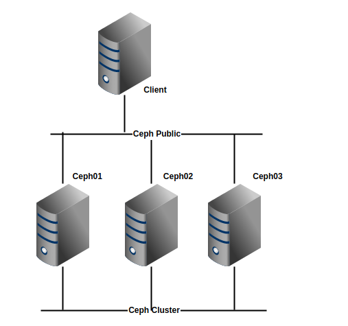
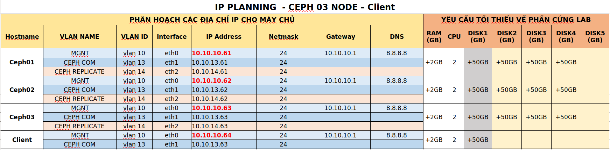

## Mount và sử dụng RBD images 

Mục tiêu: 
- Kết nối được Client vào cụm Ceph
- Thao tác cơ bản với extend dung lượng disk

## Chuẩn bị và môi trường LAB (4 Node)

- 1 cụm cài đặt Ceph 3 node
- Phiên bản cài đặt trong bài lab : [Ceph luminous](https://github.com/uncelvel/tutorial-ceph/blob/master/docs/setup/ceph-luminous.md)
- 1 Node Ceph Client Cài đặt CentOS7

## Mô hình 
- Sử dụng mô hình




## IP Planning
- Phân hoạch IP cho các máy chủ trong mô hình trên




## Chuẩn bị đấu nối 

Trên node Ceph cài đặt Ceph-Client
```sh 
yum install ceph-common -y
```

> Yêu cầu Client có đấu nối trực tiếp vào network `ceph-public`

Đứng trên node Ceph, copy key và config sang node Client 
```sh 
cd /ceph-deploy
scp ceph.conf root@10.10.10.64:/etc/ceph/
scp ceph.client.admin.keyring root@10.10.10.64:/etc/ceph/
```

Đứng trên Node Client kiểm tra kết nối Ceph 
```sh 
ceph -s
```

## Bắt đầu cài đặt 
	
Thao tác trên Node Ceph create image
```sh
rbd create --size 4096 --pool datastore vol01
```

Thao tác 
Load rbd module 

	sudo modprobe rbd

Map images to a block device

	sudo rbd map vol01 --pool datastore --name client.admin [-m {mon-IP}] [-k /path/to/ceph.client.admin.keyring]

	# If failed unsupport kernel
	rbd feature disable datastore/vol01 exclusive-lock object-map fast-diff deep-flatten
	rbd map datastore/vol01


Convert RBD to LVM  <a name="convertlvm"></a>

	fdisk /dev/rbd0

	`n` (Thêm 1 Partion mới)

	`p` (In ra Partion đang có)

	`l` (Chọn partion 1-4)

	`enter`

	`enter` (Có thể tự thay đổi dung lượng của partition nếu không muốn dùng full ổ cứng)

	`t` (Thay đổi SystemID Partion)

	`8e`

	`w`(Lưu thay đổi)


Cấu hình LVM 
https://www.ehowstuff.com/create-lvm-in-linux-centos/

`https://www.howtogeek.com/howto/40702/how-to-manage-and-use-lvm-logical-volume-management-in-ubuntu/`

	# Chỉnh file /etc/lvm/lvm.conf

		# By default we accept every block device:
			types = [ "rbd", 1024 ]
			filter = [ "r|/dev/sdb1|", "r|/dev/disk/|", "r|/dev/block/|", "a/.*/" ]

		# Or `partprobe rbd0`

	# Tạo physical volume cho LVM : 
	`pvcreate /dev/rbd0p1`
	# Device /dev/rbd0p1 not found (or ignored by filtering).
	/etc/lvm/lvm.conf
	# --> Solutions http://ceph-devel.vger.kernel.narkive.com/UZvvBAGo/poor-read-performance-on-rbd-lvm-lvm-overload
	dir = "/dev"
	scan = [ "/dev/rbd" ,"/dev" ]
	preferred_names = [ ]
	#filter = [ "a/.*/" ]
	filter = [ "a|/dev/sd*|", "a|/dev/rbd*|", "r|.*|"  ]
	types = [ "rbd", 250 ]

	# Check physical volume:
	`pvscan`

	# Tạo volume group
	`vgcreate [tên của volume group] /dev/rbd0p1`

	# Check volume group
	`pvscan`


Issue Add LVM on KVM Cần check lại

==> resolve

https://johnsontravis.wordpress.com/2016/04/29/tutorial-6-configuring-lvm-storage-for-qemukvm-vms-using-virt-manager-on-centos-7/


	# Create Logical Volume 
	lvcreate -L 132G -n lvstuff cephlvm

	# Format & mount Lv
	mkfs -t ext4 /dev/cephlvm/lvstuff
	
	mkdir /mnt/stuff
	mount -t ext4 /dev/vgpool/lvstuff /mnt/stuff


Resizing a Logical Volume

	# Resize Volume RBD 
	[root@nodeadmin ceph-deploy]# rbd resize --size 180000 rbd/rbdlvm
	Resizing image: 100% complete...done.
	[root@nodeadmin ceph-deploy]# 

	# Install format new Hard Driver 


	
	# Add New Hard Drive to Volume Group
	vgextend cephlvm /dev/rbd0p2 
	--> Failed 

`https://www.linuxquestions.org/questions/linux-newbie-8/%5Blvm%5D-pvcreate-ignored-by-filtering-4175559389/`

	# Extend Logical Volume
	lvextend -L164G /dev/cephlvm/lvstuff
	lvextend -L+45G /dev/cephlvm/lvstuff


	# Extend File System
	resize2fs /dev/cephlvm/lvstuff
```
[root@KVM ~]# df -h 
Filesystem               Size  Used Avail Use% Mounted on
/dev/mapper/centos-root   50G   19G   32G  38% /
devtmpfs                 3.9G     0  3.9G   0% /dev
tmpfs                    3.9G     0  3.9G   0% /dev/shm
tmpfs                    3.9G  8.9M  3.9G   1% /run
tmpfs                    3.9G     0  3.9G   0% /sys/fs/cgroup
/dev/sda1               1014M  143M  872M  15% /boot
/dev/mapper/centos-home   92G   33M   92G   1% /home
tmpfs                    783M     0  783M   0% /run/user/0
umount /home/
df -h 
lvscan 
lvremove /dev/centos/home
lvextend -L+91G /dev/centos/root
resize2fs /dev/centos/root
fdisk -l 
vgscan 
lvscan 
pvdisplay 
xfs_growfs /dev/centos/root

[root@KVM ~]# df -h 
Filesystem               Size  Used Avail Use% Mounted on
/dev/mapper/centos-root  141G   19G  123G  14% /
devtmpfs                 3.9G     0  3.9G   0% /dev
tmpfs                    3.9G     0  3.9G   0% /dev/shm
tmpfs                    3.9G  8.9M  3.9G   1% /run
tmpfs                    3.9G     0  3.9G   0% /sys/fs/cgroup
/dev/sda1               1014M  143M  872M  15% /boot
tmpfs                    783M     0  783M   0% /run/user/0
[root@KVM ~]# 

```


## 4.6 CEPH file system to use Block Device <a name=4.6></a>

Add host

add ssh_config 

add user on ceph client

add sudo for cephuser 

copy ssh key

Install ceph on Node Admin
	
	# Install ceph
	ceph-deploy install nodeclient
	# Copy config 
	ceph-deploy admin nodeclient

CREATE A BLOCK DEVICE POOL on node Admin
	
Configuration Block Device on **NodeClient**

	# Create Block device image
	rbd create foo --size 4096 [-m {mon-IP}] [-k /path/to/ceph.client.admin.keyring]
	
	rbd create --size 4096 --pool datastore vol01 -m 172.16.0.146 -m 172.16.0.147 -m 172.16.0.148 -k /etc/ceph/ceph.client.admin.keyring

	# OR

	rbd create --size 4096 --pool datastore vol01

Load rbd module 

	sudo modprobe rbd


Map images to a block device

	sudo rbd map vol01 --pool datastore --name client.admin [-m {mon-IP}] [-k /path/to/ceph.client.admin.keyring]

	# If failed unsupport kernel
	rbd feature disable datastore/vol01 exclusive-lock object-map fast-diff deep-flatten

	# And rerun Ok 
	[root@nodeclient ~]# sudo modprobe rbd
	[root@nodeclient ~]# rbd feature disable datastore/vol01 exclusive-lock object-map fast-diff deep-flatten
	[root@nodeclient ~]# rbd map datastore/vol01
	/dev/rbd0


Create file system to use Block Device

	sudo mkfs.ext4 -m0 /dev/rbd0
	# take a few moments ...

Mount File System

	sudo mkdir /mnt/ceph-block-device
	sudo mount /dev/rbd0 /mnt/ceph-block-device
	cd /mnt/ceph-block-device

	#/etc/fstab
	#=============== Mount Media File=======================================
	/dev/sdc        /u01/media_storage      ext4    defaults        0       1


benchmark Disk


Using /etc/ceph/rbdmap 
	
	rbd/images01            id=admin,keyring=/etc/ceph/ceph.client.admin.keyring

	[root@nodeclient ~]# sudo modprobe rbd
	[root@nodeclient ~]# rbd feature disable rbd/images01 exclusive-lock object-map fast-diff deep-flatte
	[root@nodeclient ~]# systemctl start rbdmap && systemctl enable rbdmap
	# Fstab 
	/dev/rbd0	/Volume1 ext4 defaults,noatime,_netdev 0 0


Setup RBD at Boot time

	# Create bash mount RBD
	cd /usr/local/bin/
	vim rbd-mount
	# --------Begin rbd-mount --------
	#!/bin/bash
	# Change with your pools name
	export poolname=rbd
	# CHange with your disk image name
	export rbdimage=disk01
	# Mount Directory
	export mountpoint=/mnt/mydisk
	# Image mount/unmount and pool are passed from the systems service as arguments
	# Determine if we are mounting or unmounting
	if [ "$1" == "m" ]; then
		modprobe rbd
		rbd feature disable $rbdimage exclusive-lock object-map fast-diff deep-flatten
		rbd map $rbdimage --id admin --keyring /etc/ceph/ceph.client.admin.keyring
		mkdir -p $mountpoint
		mount /dev/rbd/$poolname/$rbdimage $mountpoint
	fi
	if [ "$1" == "u" ]; then
		umount $mountpoint
		rbd unmap /dev/rbd/$poolname/$rbdimage
	fi
	# --------End rbd-mount --------

	# Make executable
	chmod +x rbd-mount

	# Create service file
	cd /etc/systemd/system/
	vim rbd-mount.service
	# --------Begin rbd-mount.service -------- 
	[Unit]
	Description=RADOS block device mapping for $rbdimage in pool $poolname"
	Conflicts=shutdown.target
	Wants=network-online.target
	After=NetworkManager-wait-online.service
	[Service]
	Type=oneshot
	RemainAfterExit=yes
	ExecStart=/usr/local/bin/rbd-mount m
	ExecStop=/usr/local/bin/rbd-mount u
	[Install]
	WantedBy=multi-user.target
	# --------End rbd-mount.service -------- 

	# Enable rbd-mount at boot time
	systemctl daemon-reload
	systemctl enable rbd-mount.service
