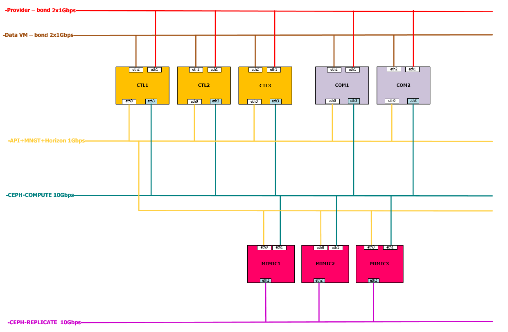

# OpenStack tích hợp với Ceph

Mô hình cụm Ceph kết nối OpenStack đầy đủ sẽ bao gồm cụm Ceph và Cụm OpenStack HA và Monitor node



Đối với OpenStack có 3 thành phần có thể kết nối được với Ceph. 

- Images: OpenStack Glance quản lý các image cho các VM, lưu trữ các images dưới dạng nhị phân. 
- Volumes: Các Block Devices được sử dụng để boot các VM hoặc là các ổ đĩa đính kèm thêm cho VM
- Guest Disk: Mặc định khi khởi động VM thì disk của nó được xuất hiện lưu trữ dưới dạng filesystems  (Thường là /var/lib/nova/instances/uuid/). 

Từ bản sau Hanava thì có thể khởi động mọi VM lưu trữ trực tiếp trong Ceph mà không cần sử dụng Cinder. Điều này thuận tiện cho việc di chuyển các VM từ node compute này sang node compute khác gần như tức thì. Chúng ta có thể sử dụng Glance để lưu trữ các images trên Ceph Block Device, và chúng ta có thể khởi động 1 VM bằng cách sử dụng 1 bản sao của 1 images. 

[1. Chuẩn bị mô hình](#1)

[2. Tích hợp Glance](#2) 

[3. Tích hợp Cinder](#3) 

[4. Tích hợp Nova](#4)  

## 1. Mô hình của Ceph hiện tại
Cài đặt theo 1 trong các cách sau
- Cụm node hoàn chỉnh (Gần giống với môi trường Product) [Tutorial](Link)
- CephAIO (Chỉ để LAB ko khuyến cáo môi trường Product) [Tutorial](Link)

## 2. Mô hình của OpenStack hiện tại
Cài đặt theo 1 trong các cách sau
- Cụm cài đặt Manual 2node [Tutorial](manual_install.md)
- Cụm cài đặt HA [Tutorial](ha_install.md)
- Cụm cài đặt Pacstack [Tutorial](packstack_install.md)

## 3. Môi trường chuẩn bị <a name="1"></a>

Yêu cầu: Có cụm Ceph và OpenStack được cài đặt theo 2 tutorial trước đó (Trong tutorial này sử dụng Ceph 3 node + OpenStack manual 3 node)

- Cụm OpenStack
	```sh 
	- Controller: 
		- Manager_api_horizon_network: 10.10.10.71
		- Provider: 10.10.11.71
		- Data_VM: 10.0.12.71
        - Ceph-Com: 10.0.0.13.71
	- Compute1: 
		- Manager_api_horizon_network: 10.10.10.72
		- Provider: 10.10.11.72
		- Data_VM: 10.0.12.72
        - Ceph-Com: 10.0.0.13.72
	- Compute2: 
		- Manager_api_horizon_network: 10.10.10.73
		- Provider: 10.10.11.73
		- Data_VM: 10.0.12.73
        - Ceph-Com: 10.0.0.13.73
	```

- Cụm Ceph
	```sh 
	- Ceph1: 
		- Manager_network: 10.10.10.61
		- Public_network(Ceph-Com): 10.10.13.61
        - Cluster_network(Ceph-Rep): 10.10.14.61
	- Ceph2:
		- Manager_network: 10.10.10.62
		- Public_network(Ceph-Com): 10.10.13.62
        - Cluster_network(Ceph-Rep): 10.10.14.62
	- Ceph3:
		- Manager_network: 10.10.10.63
		- Public_network(Ceph-Com): 10.10.13.63
        - Cluster_network(Ceph-Rep): 10.10.14.63
	```

- Cài đặt lib ceph python cho các node `Compute` và `Controller`
	```
	yum install -y python-rbd ceph-common
	```

- Tạo pool trên Ceph

	> Lưu ý: Có thể tính toán trước số PG khi tạo các pool bằng cách sử dụng công cụ tính toán có sẵn trên trang chủ http://ceph.com/pgcalc
	```sh 
	ceph osd pool create volumes 128 128
	ceph osd pool create vms 128 128
	ceph osd pool create images 128 128
	ceph osd pool create backups 128 128
	```
	
- Khởi tạo ban đầu trước khi sử dụng pool
	```sh 
	rbd pool init volumes
	rbd pool init vms
	rbd pool init images
	rbd pool init backups
	```

- Thực hiện copy cấu hình qua các node Controller, Compute
	```sh 
	ssh 10.10.10.71 sudo tee /etc/ceph/ceph.conf < /etc/ceph/ceph.conf
	ssh 10.10.10.72 sudo tee /etc/ceph/ceph.conf < /etc/ceph/ceph.conf
	ssh 10.10.10.73 sudo tee /etc/ceph/ceph.conf < /etc/ceph/ceph.conf
	```
	> Việc copy `ceph.conf` có thể sử dụng `ceph-deploy` 

## 4. Cấu hình CEPH làm backend cho Glance-Images <a name="2"></a>

### 4.1 Thực hiện trên Node Ceph

- Tạo key `glance`
	```sh 
	ceph auth get-or-create client.glance mon 'allow r' osd 'allow class-read object_prefix rbd_children, allow rwx pool=images' 
	```                                          

- Chuyển key glance sang node glance (Ở đây Glance cài trên Controller)
	```sh 
	ceph auth get-or-create client.glance | ssh 10.10.10.71 sudo tee /etc/ceph/ceph.client.glance.keyring
	```

### 4.2 Thực hiện trên Node Controller

- Set quyền cho các key
	```sh 
	sudo chown glance:glance /etc/ceph/ceph.client.glance.keyring

	sudo chmod 0640 /etc/ceph/ceph.client.glance.keyring
	```

- Thêm cấu hinh `/etc/glance/glance-api.conf ` trên node Controller
	```sh 
	[DEFAULT]
	show_image_direct_url = True

	[glance_store]
	show_image_direct_url = True
	default_store = rbd
	stores = file,http,rbd
	rbd_store_pool = images
	rbd_store_user = glance
	rbd_store_ceph_conf = /etc/ceph/ceph.conf
	rbd_store_chunk_size = 8
	```

- Restart lại dịch vụ glance trên cả node Controller
	```sh 
	systemctl restart openstack-glance-*
	```

- Source credential
	```sh 
	source admin-openrc
	```

- Tạo thử images
	```sh
	wget http://download.cirros-cloud.net/0.3.4/cirros-0.3.4-x86_64-disk.img
	openstack image create "cirros-ceph" \
	--file cirros-0.3.4-x86_64-disk.img \
	--disk-format qcow2 --container-format bare \
	--public
	```

### 4.3 Quay lại kiểm tra trên node Ceph

- Kiểm tra trên node ceph
	```sh
	rbd -p images ls
	```

## 5. Cấu hình CEPH làm backend cho Cinder-Volume và Cinder-backup <a name="3"></a>

### 5.1 Thao tác trên Node Ceph
- Di chuyển vào ceph-deploy folder
	```sh
	cd ceph-deploy
	```

- Tạo key `cinder`
	```sh
	ceph auth get-or-create client.cinder mon 'allow r, allow command "osd blacklist", allow command "blacklistop"' osd 'allow class-read object_prefix rbd_children, allow rwx pool=volumes, allow rwx pool=images' > ceph.client.cinder.keyring
	```

- Tạo key `cinder-backup`
	```sh 
	ceph auth get-or-create client.cinder-backup mon 'profile rbd' osd 'profile rbd pool=backups' > ceph.client.cinder-backup.keyring
	```

- Chuyển key `cinder` và key `cinder-backup` sang các node cài đặt Cinder(Ở đây là các node Controller)
	```sh
	ceph auth get-or-create client.cinder | ssh 10.10.10.71 sudo tee /etc/ceph/ceph.client.cinder.keyring

	ceph auth get-or-create client.cinder-backup | ssh 10.10.10.71 sudo tee /etc/ceph/ceph.client.cinder-backup.keyring
	```

- Chuyển key cinder sang các node Compute
	```sh
	ceph auth get-or-create client.cinder | ssh 10.10.10.72 sudo tee /etc/ceph/ceph.client.cinder.keyring
	ceph auth get-or-create client.cinder | ssh 10.10.10.73 sudo tee /etc/ceph/ceph.client.cinder.keyring

	ceph auth get-key client.cinder | ssh 10.10.10.72 tee /root/client.cinder
	ceph auth get-key client.cinder | ssh 10.10.10.73 tee /root/client.cinder
	```

### 5.2 Thao tác trên Node Controller 

- Set quyền cho các key
	```sh 
	sudo chown cinder:cinder /etc/ceph/ceph.client.cinder*

	sudo chmod 0640 /etc/ceph/ceph.client.cinder*
	```

### 5.3 Thao tác trên Node Compute

- Khởi tạo 1 `uuid` mới cho Cinder
	```sh
	uuidgen
	```
	> Output 
	```sh 
	414ba151-4068-40c6-9d7b-84998ce6a5a6
	```

> Lưu ý UUID này sẽ sử dụng chung cho các Compute nên chỉ cần tạo lần đầu tiên

- Tạo file xml cho phép Ceph RBD (Rados Block Device) xác thực với libvirt thông qua `uuid` vừa tạo
	```sh 
	cat > ceph-secret.xml <<EOF
	<secret ephemeral='no' private='no'>
	<uuid>414ba151-4068-40c6-9d7b-84998ce6a5a6</uuid>
	<usage type='ceph'>
		<name>client.cinder secret</name>
	</usage>
	</secret>
	EOF

	sudo virsh secret-define --file ceph-secret.xml
	```
	> Output 
	```sh 
	Secret 414ba151-4068-40c6-9d7b-84998ce6a5a6 created
	```

- Gán giá trị của `client.cinder` cho `uuid`
	```sh 
	virsh secret-set-value --secret 414ba151-4068-40c6-9d7b-84998ce6a5a6 --base64 $(cat /root/client.cinder)
	```
	> Output 
	```sh 
	Secret value set   
	```

- Bổ sung cấu hinh `/etc/cinder/cinder.conf` tren cac node controller
	```sh 
	[DEFAULT]
	notification_driver = messagingv2
	enabled_backends = ceph
	glance_api_version = 2
	backup_driver = cinder.backup.drivers.ceph
	backup_ceph_conf = /etc/ceph/ceph.conf
	backup_ceph_user = cinder-backup
	backup_ceph_chunk_size = 134217728
	backup_ceph_pool = cinder-backup
	backup_ceph_stripe_unit = 0
	backup_ceph_stripe_count = 0
	restore_discard_excess_bytes = true

	[ceph]
	volume_driver = cinder.volume.drivers.rbd.RBDDriver
	volume_backend_name = ceph
	rbd_pool = volumes
	rbd_ceph_conf = /etc/ceph/ceph.conf
	rbd_flatten_volume_from_snapshot = false
	rbd_max_clone_depth = 5
	rbd_store_chunk_size = 4
	rados_connect_timeout = -1
	rbd_user = cinder
	rbd_secret_uuid = 414ba151-4068-40c6-9d7b-84998ce6a5a6
	report_discard_supported = true
	```

- Enable cinder-backup và restart dịch vụ cinder 
	```sh 
	systemctl enable openstack-cinder-backup.service
	systemctl start openstack-cinder-backup.service
	```

- Restart lại dịch vụ trên Node Controller
	```sh 
	systemctl restart openstack-cinder-api.service openstack-cinder-volume.service openstack-cinder-scheduler.service openstack-cinder-backup.service
	```

### 5.4 Quay lại node Controller

- Source credential
	```sh 
	source admin-openrc
	```

- Tạo volume type node controller
	```sh
	cinder type-create ceph
	cinder type-key ceph set volume_backend_name=ceph
	```

- Restart lai dich vu nova-compute trên node Compute
	```sh 
	systemctl restart openstack-nova-compute
	```

## 6. Cấu hình CEPH làm backend cho Nova-Compute <a name="3"></a>

Mặc định các VM được tạo từ Images sẽ lưu file disk ngay chính trên Compute, Việc tích hợp này cho phép file disk này được tạo 1 symlink lưu trữ dưới Ceph thay vì lưu local.

### 6.1 Thao tác trên Node Ceph
- Tạo keyring cho nova
	```sh 
	ceph auth get-or-create client.nova mon 'allow r' osd 'allow class-read object_prefix rbd_children, allow rwx pool=vms, allow rx pool=images' -o /etc/ceph/ceph.client.nova.keyring 
	```

- Copy key `nova` sang các node Compute
	```sh
	ceph auth get-or-create client.cinder | ssh 10.10.10.72 sudo tee /etc/ceph/ceph.client.cinder.keyring
	ceph auth get-or-create client.cinder | ssh 10.10.10.73 sudo tee /etc/ceph/ceph.client.cinder.keyring

	ceph auth get-key client.cinder | ssh 10.10.10.72 tee /root/client.cinder
	ceph auth get-key client.cinder | ssh 10.10.10.73 tee /root/client.cinder
	```

### 6.2 Thao tác trên Node Compute
- Set quyền trên node COM
	```sh 
	chgrp nova /etc/ceph/ceph.client.nova.keyring

	chmod 0640 /etc/ceph/ceph.client.nova.keyring
	```

- Genkey UUID 
	```sh
	uuidgen
	```
	> Output
	```sh
	805b9716-7fe8-45dd-8e1e-5dfdeff8b9be
	```
> Lưu ý UUID này sẽ sử dụng chung cho các Compute nên chỉ cần tạo lần đầu tiên

- Tạo file xml cho phép Ceph RBD (Rados Block Device) xác thực với libvirt thông qua `uuid` vừa tạo
	```sh 
	cat << EOF > nova-ceph.xml
	<secret ephemeral="no" private="no">
	<uuid>805b9716-7fe8-45dd-8e1e-5dfdeff8b9be</uuid>
	<usage type="ceph">
	<name>client.nova secret</name>
	</usage>
	</secret>
	EOF

	sudo virsh secret-define --file nova-ceph.xml
	```
	> Output 
	```sh 
	Secret 805b9716-7fe8-45dd-8e1e-5dfdeff8b9be created
	```

- Gán giá trị của `client.nova` cho `uuid`
	```sh 
	virsh secret-set-value --secret 805b9716-7fe8-45dd-8e1e-5dfdeff8b9be --base64 $(cat /root/client.nova)
	```
	> Output 
	```sh 
	Secret value set   
	```

- Chỉnh sửa nova.conf trên COM `/etc/nova/nova.conf`
	```sh
	[libvirt]
	images_rbd_pool=vms
	images_type=rbd
	rbd_secret_uuid=805b9716-7fe8-45dd-8e1e-5dfdeff8b9be
	rbd_user=nova
	images_rbd_ceph_conf = /etc/ceph/ceph.conf
	```

- Restart service 
	```sh 
	systemctl restart openstack-nova-compute 
	```

- Tạo máy ảo (Tạo boot từ images) và kiểm tra 
	```sh 
	rbd -p vms ls
	rbd -p compute info c0f90bd2-9f8a_disk
	```

# Tài liệu tham khảo 

[1. Nguyên tắc sao lưu dữ liệu của Cinder int32bit's Blog](http://int32bit.me/2017/03/30/Cinder%E6%95%B0%E6%8D%AE%E5%8D%B7%E5%A4%87%E4%BB%BD%E5%8E%9F%E7%90%86%E5%92%8C%E5%AE%9E%E8%B7%B5/)

[2. OpenStack backup Sebatian-han](https://www.sebastien-han.fr/blog/2015/02/17/openstack-and-backup/)

[3. OpenStack backup Sebatian-han2](https://www.sebastien-han.fr/blog/2015/10/05/openstack-nova-snapshots-on-ceph-rbd/)

[4. Ceph Type trong libvirt](https://libvirt.org/formatsecret.html#CephUsageType)

[4.2 Set Quota cho VM2](https://wiki.openstack.org/wiki/InstanceResourceQuota)